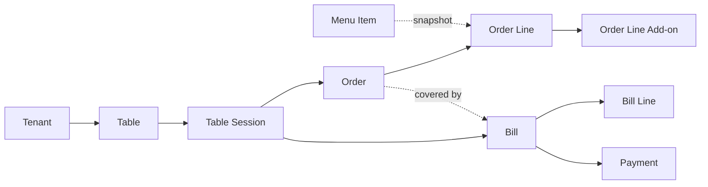
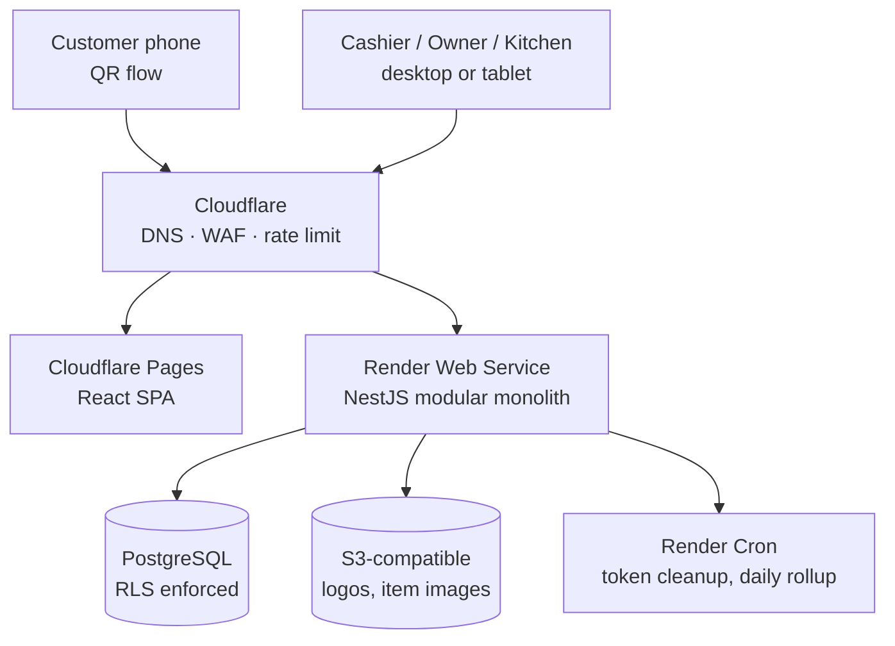
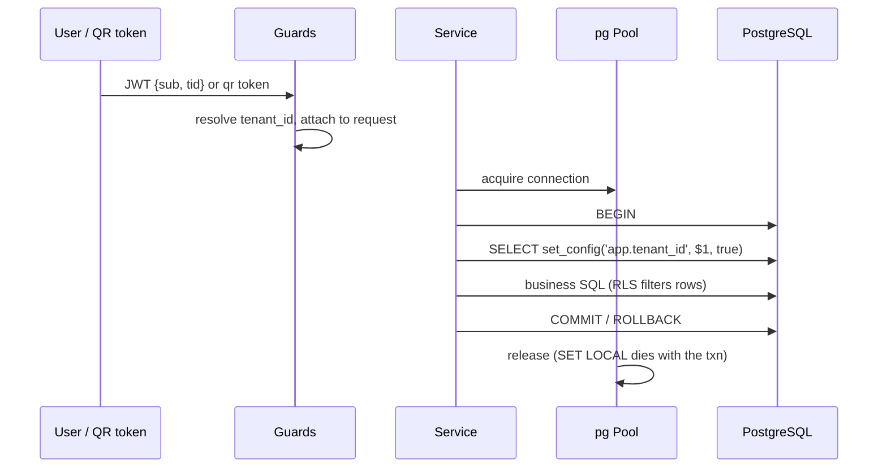
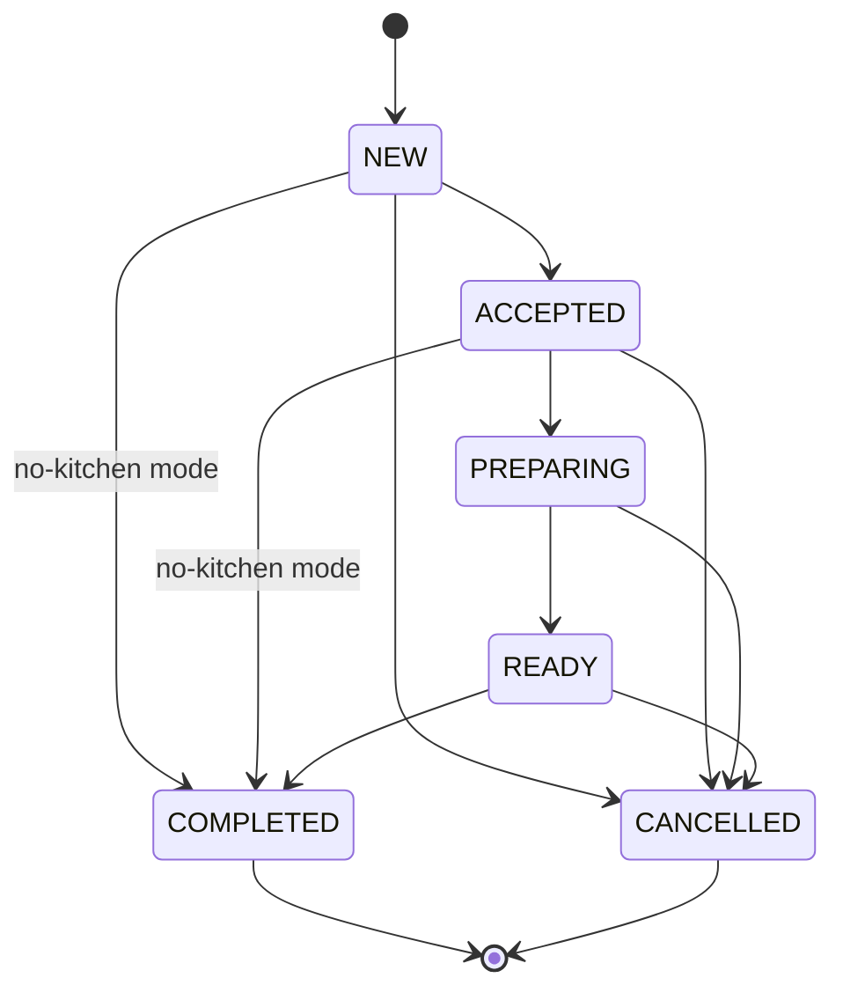
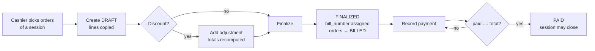
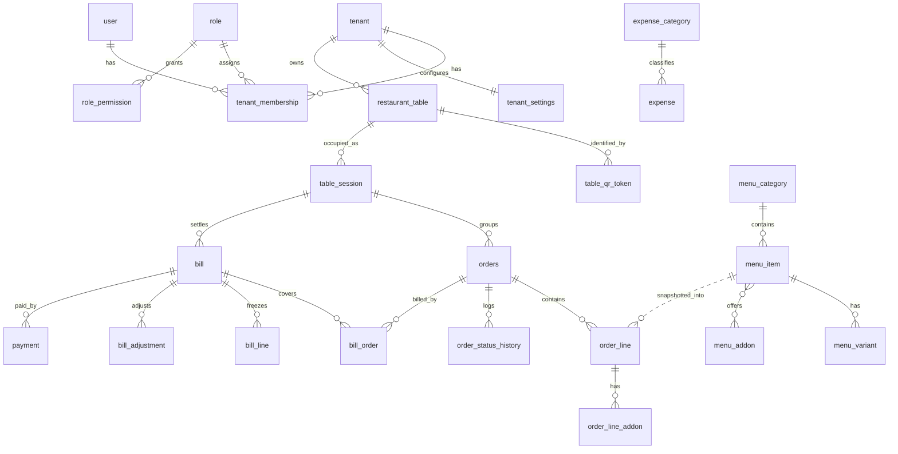

# Restaurant SaaS Platform — V1 Architecture

2026-09-17 · Prepared for Kamran

## 1. Executive Summary

V1 is a NestJS modular monolith over a single PostgreSQL database, with tenant isolation enforced by Row Level Security driven from a per-request `SET LOCAL` of the tenant id, and a React/Vite SPA serving both the public QR ordering flow and the authenticated restaurant back-office. The locked stack is accepted in full; no Redis, brokers, ORM, or Docker are needed for V1.

The domain is built around five separate concepts that the brief already hints at and that this design makes explicit: **Table Session** (a table occupied from first seat to settlement), **Order** (one customer's request, channel-agnostic), **Bill** (a financial snapshot over one or more orders, immutable once finalized), **Payment** (a provider-agnostic settlement record against a bill), and **Menu** (versioned by snapshotting prices into order lines, not by versioning the menu itself).

The most consequential decisions, each with an ADR in section 17:

| Decision | Choice | Why it matters |
| --- | --- | --- |
| Tenant isolation | RLS on every tenant table + non-superuser app DB role + `SET LOCAL app.tenant_id` inside a transaction per request | Isolation does not depend on developers remembering `WHERE tenant_id` |
| Money | `BIGINT` paise everywhere; totals stored as columns, never recomputed from floats | Reproducible bills, GST-ready |
| Order concurrency | Optimistic `version` column on orders and bills + state-transition table enforced in one SQL transaction | Two cashiers cannot silently overwrite each other |
| Idempotency | Client-generated `idempotency_key` on every write that creates money or orders | Retries after network loss create nothing twice |
| Order lifecycle | Fixed state machine; restaurant config chooses which states are *visible*, not which exist | Small dhaba goes NEW → COMPLETED without a different code path |
| QR | Opaque random token per table, mapped server-side; rotatable | Table renames never break printed QRs; tokens can be revoked |
| Bill vs Order | Bill snapshots order lines into `bill_line` at finalization | Later order edits never mutate a finalized bill |
| Realtime | Polling with TanStack Query (3–5 s) in V1; SSE as the upgrade path | No WebSocket infra on Render for V1; kitchen/cashier screens still feel live |

Three places where I push back on the brief (details in section 18): customer name as a hard requirement on QR orders will lose orders at the table and should be tenant-configurable with a sensible default; "Cashier verifies UPI by looking at the phone" is a fraud surface that needs a reference-number field and an audit line from day one; and Render's free/starter Postgres has no point-in-time recovery, which is unacceptable once real bills exist, so staging must use a paid instance or a managed Postgres from launch.

## 2. Product Scope, V1 Scope, Future Scope

The product is a single-plan, multi-tenant restaurant operations SaaS for Indian small and medium restaurants. Everything a restaurant needs to take an order, cook it, bill it, collect money, and know whether the day made a profit is in V1. Everything that needs an external provider (payment gateway, maps, WhatsApp API, GST filing) is future.

### Explicit V1 scope

| Area | In V1 | Explicitly not in V1 (but modeled for) |
| --- | --- | --- |
| Tenancy | Restaurant onboarding, settings, one plan | Subscription tiers, billing the restaurant itself |
| Users | Owner/Manager/Cashier/Kitchen roles, invite by email+password | Custom roles UI, SSO, OTP login |
| Tables & QR | Table CRUD, opaque QR token, regenerate/revoke, printable QR sheet | Reservations, floor plan |
| Customer ordering | Scan → menu → cart → name → place order; order status page | Customer accounts, editing/cancelling own order, pay-first |
| Counter/POS | Dine-in/takeaway manual orders, edit any order, per-order and per-session billing | Split bills, partial payments |
| Orders | State machine NEW→ACCEPTED→PREPARING→READY→COMPLETED, kitchen states optional, cancel with reason | Refund workflow tied to cancellation |
| Billing | Bill from one or many orders of a session, percent/fixed discount, immutable after finalize, bill void | GST/tax lines, service charge, delivery charge |
| Payments | Cash, static UPI (manual verify with reference), payment idempotency | Gateway, webhooks, auto-verify, refunds |
| Menu | Categories, items, variants, add-ons, availability toggle, image upload, sort order, soft delete | Combos, time-based menus, inventory |
| Kitchen | Feature-flagged KDS screen, polling | Kitchen printer, station routing |
| Printing | Browser print of bill and kitchen slip, 58/80 mm and A4 CSS layouts | Direct ESC/POS |
| Expenses | CRUD, configurable categories, payment method | Attachments/receipts, recurring expenses |
| Dashboard | Today/week/month: orders, revenue, collected, expenses, operating profit, cash vs UPI, AOV, breakdowns | Exports, custom date ranges beyond month, accounting |
| Audit | Order/bill/payment/expense/menu-price/settings/user-role events | Full field-level history |
| Platform admin | Bootstrap script creates tenant + owner; internal-only admin endpoints behind a separate role | Admin UI |

### Future scope (architecture-prepared, not implemented)

Pay-first ordering, payment gateways and webhooks, GST, refunds, WhatsApp channel, delivery with distance pricing, customer accounts and history, loyalty, inventory, kitchen printers, advanced reports, subscription plans. Sections 16 and 17 show exactly which V1 tables and modules each one plugs into.

## 3. Actors and Roles

Six actors touch the system; only four of them authenticate. Roles are tenant-scoped and permission-based, so a fifth role can be added later by inserting rows, not code.

| Actor | Authenticates | Scope | V1 default permissions |
| --- | --- | --- | --- |
| Customer | No (QR token only) | One table's public session | Read menu, create order at that table, view own order status by order token |
| Owner | Yes | Tenant | All permissions |
| Manager | Yes | Tenant | Everything except `users.manage`, `settings.payments.manage`, `tenant.delete` |
| Cashier | Yes | Tenant | `orders.*`, `bills.*`, `payments.*`, `tables.read`, `sessions.*`, `menu.availability.update`, `kitchen.read` |
| Kitchen Staff | Yes | Tenant | `kitchen.read`, `orders.transition.kitchen`, `menu.availability.update` |
| Platform Admin | Yes (separate credential class) | Cross-tenant, impersonation-free | Create tenant, suspend tenant, read health; never reads order data in V1 |

Permission strings follow `resource.action` and live in a `permission` table seeded by migration. Role → permission mapping is data (`role_permission`), and `role.is_system = true` rows are read-only in the UI. That is the whole RBAC: no hierarchy, no inheritance, no per-object ACLs. Cashiers being allowed to toggle item availability is deliberate: the counter is where "we're out of paneer" is discovered.

## 4. Core Domain Model and Domain Boundaries

The model separates *who is sitting where* (Table Session), *what each person asked for* (Order), *what the restaurant is charging* (Bill) and *what money actually arrived* (Payment). Conflating any two of these is the root of most POS bugs.



A Bill covers one or more Orders via `bill_order`; a Bill Line is a frozen copy of an Order Line. Takeaway and counter orders have a Table Session with `table_id = NULL` so billing code has exactly one path.

### Domain boundaries (NestJS modules)

| Module | Owns | Depends on | Exposes to others |
| --- | --- | --- | --- |
| `tenancy` | tenant, settings, tenant context middleware | — | `TenantContext`, `SettingsReader` |
| `identity` | user, membership, role, permission, tokens | tenancy | `AuthGuard`, `PermissionGuard`, `CurrentUser` |
| `tables` | table, qr token, table session | tenancy | `SessionService.openOrGet()` |
| `menu` | category, item, variant, add-on, availability, images | tenancy, storage | `MenuSnapshotService.priceLine()` |
| `orders` | order, order line, line add-on, status history, state machine | tables, menu | `OrderService`, domain events (in-process) |
| `billing` | bill, bill line, bill order, discount, bill status | orders, tables | `BillService` |
| `payments` | payment, payment status, provider abstraction (cash/upi in V1) | billing | `PaymentService` |
| `kitchen` | read-model queries for KDS, kitchen transitions | orders | — |
| `expenses` | expense, expense category | tenancy | — |
| `reporting` | dashboard SQL aggregates | orders, billing, payments, expenses (read-only) | — |
| `audit` | audit_event append | all (via interceptor) | `AuditWriter` |
| `public` | unauthenticated QR endpoints, customer order tokens | tables, menu, orders | — |
| `platform` | tenant provisioning, platform-admin auth | tenancy, identity | — |
| `storage` | S3 pre-signed upload/download | — | `StorageService` |

Dependency direction is enforced by ESLint `no-restricted-imports` per module folder: `orders` may import from `menu`, `menu` may never import from `orders`. Cross-module writes go through the owning module's service inside the caller's transaction (a `TransactionContext` is passed explicitly); no module writes another module's tables directly. Domain events (`OrderPlaced`, `BillFinalized`, `PaymentRecorded`) are in-process NestJS `EventEmitter` events emitted *after* commit, consumed only by `audit` and, later, notifications. They are not a message bus and nothing critical depends on them.

## 5. Architecture Overview

One SPA, one API process, one database. Cloudflare fronts everything; Render runs the API; the SPA is static on Cloudflare Pages.



The API is stateless: every request carries a JWT or a QR/order token, opens one DB transaction, sets tenant context inside it, does its work, commits, and the connection returns to the pool with the context gone. That single rule (section 6) is what makes the monolith horizontally scalable later without any change.

Request pipeline, in order: Cloudflare rate limit → Helmet headers → correlation-id middleware → body size limit → JSON parse → Zod validation pipe → `AuthGuard` (JWT or public token) → `TenantGuard` (binds tenant) → `PermissionGuard` → controller → service (opens transaction, `SET LOCAL app.tenant_id`) → repository (raw SQL via `pg`) → commit → audit/domain events → response envelope.

What deliberately is **not** here: no Redis (sessions are stateless JWT; cache is TanStack Query on the client and Postgres itself), no queue (the only async work is a nightly cron and image processing that runs inline), no WebSocket server (polling at 3–5 s on kitchen and cashier screens; SSE is the documented upgrade), no ORM (a thin repository layer over `pg` with typed query helpers).

## 6. Multi-Tenant Architecture and RLS Strategy

Tenant isolation is enforced in three layers that must all be bypassed for a leak to happen: the JWT carries the tenant, the request sets it into the database session inside a transaction, and RLS policies on every tenant table refuse rows whose `tenant_id` does not match. The application code never adds `WHERE tenant_id` for correctness; it may add it for index selectivity.

### How tenant context flows



1. **Establishing context.** `AuthGuard` verifies the access JWT and reads `tid` (tenant id) and `sub` (user id). For public QR routes, `PublicQrGuard` looks up the QR token in `table_qr_token` using a dedicated `app_public` database role whose policies allow only token lookup; once the row is found, the tenant id is known and the request proceeds as that tenant with `app.actor_kind = 'customer'`.
2. **User → tenant mapping.** A `user` row is global (one email, one password hash). `tenant_membership(user_id, tenant_id, role_id, status)` maps users to tenants. The login response lists memberships; the client selects one, and the access token is minted for exactly one `tid`. V1 owners with two restaurants switch by re-issuing a token, never by a request parameter.
3. **Reaching PostgreSQL.** Every service method that touches tenant data runs inside `withTenantTx(ctx, fn)`, which does `BEGIN; SELECT set_config('app.tenant_id', $1, true); SELECT set_config('app.user_id', $2, true); SELECT set_config('app.actor_kind', $3, true);` then `fn(client)` then `COMMIT`. `set_config(..., true)` is `SET LOCAL`: the value is transaction-scoped and vanishes on commit or rollback. There is no code path that runs tenant SQL outside `withTenantTx`; a lint rule forbids importing `pool.query` outside the `database` module.
4. **RLS policies.** Every table with a `tenant_id` column gets:

```sql
ALTER TABLE orders ENABLE ROW LEVEL SECURITY;
ALTER TABLE orders FORCE ROW LEVEL SECURITY;  -- applies even to the table owner
CREATE POLICY tenant_isolation ON orders
  USING (tenant_id = current_setting('app.tenant_id', true)::uuid)
  WITH CHECK (tenant_id = current_setting('app.tenant_id', true)::uuid);
```

   `current_setting(name, true)` returns NULL when unset, and `NULL = uuid` is NULL, so an unset context sees **zero rows** rather than all rows. That fail-closed behaviour is the single most important property here. `WITH CHECK` means an INSERT with the wrong `tenant_id` is rejected, so the backend also sets `tenant_id` from context in every INSERT rather than trusting request bodies.
5. **Database roles.** Migrations run as `app_migrator` (table owner). The API connects as `app_rw`, which has `NOBYPASSRLS`, no ownership, and only `SELECT/INSERT/UPDATE/DELETE` grants. `app_public` has `SELECT` on `table_qr_token`, `menu_*` and `INSERT` on `orders` only via a `SECURITY DEFINER` function. Using a superuser or table owner as the app role silently disables RLS; this is enforced by a startup check that asserts `rolbypassrls = false` for the connected role and refuses to boot otherwise.
6. **Connection pooling.** `pg.Pool` in-process, `max = 10` per API instance (Render starter Postgres allows 97 connections). Because context is `SET LOCAL` inside a transaction, a released connection carries nothing; a pooled connection can never leak a previous tenant. Do not use `SET` (session-level) or PgBouncer in transaction mode with session-level settings. If PgBouncer is added later, transaction pooling mode remains safe precisely because everything is `SET LOCAL`.
7. **Reset between requests.** Nothing to reset: the transaction boundary is the reset. As belt-and-braces, the pool's `release` hook runs `DISCARD ALL` only when a client is released in an error state.
8. **Background jobs.** A job is just a function that calls `withTenantTx` per tenant. Cross-tenant jobs (nightly rollup) iterate tenants as `app_rw` with `app.actor_kind = 'system'` and open one transaction per tenant; they never run one query across all tenants. A future queue worker uses the same helper.
9. **Cross-tenant prevention.** Path parameters like `/orders/:id` are looked up under RLS: a foreign id returns 0 rows → 404, never 403, so ids are not an oracle. Foreign keys are composite `(tenant_id, x_id)` on the child side where the parent is tenant-owned (`order_line.tenant_id + order_id` references `orders(tenant_id, id)`), so even a bug that passes a foreign `order_id` cannot attach a line to another tenant's order.
10. **Platform admin.** A separate `platform_admin` table and a separate JWT audience `aud: 'platform'`. Platform routes run as `app_platform`, a role with a policy `USING (current_setting('app.actor_kind', true) = 'platform')` on `tenant`, `tenant_membership`, and `user` only. Platform admin cannot read orders or bills in V1; support access to a tenant's data, if ever needed, is a break-glass flow that mints a normal tenant-scoped token and writes an audit event.
11. **Testing isolation.** An integration test suite seeds two tenants with identical data and, for every repository method, asserts that a call under tenant A returns no B rows and cannot mutate B rows. A separate test runs every migration and then queries `pg_tables` joined to `pg_policies` to assert that every table with a `tenant_id` column has RLS enabled, forced, and at least one policy; the CI job fails otherwise. A third test asserts `app_rw` cannot `BYPASSRLS`.
12. **Detecting leakage.** Every response envelope for a list endpoint passes through a dev/staging-only interceptor that scans returned objects for `tenantId` fields not equal to the request tenant and throws. In production, a `pg_stat_statements` sample and a weekly audit query `SELECT count(*) FROM orders WHERE tenant_id NOT IN (SELECT id FROM tenant)` guard against orphaning. Any `403`/`0-row` on an id that exists in another tenant is logged with both ids as a `tenant_probe` warning.

### Tables without tenant_id

`user`, `permission`, `platform_admin`, `refresh_token` (scoped by user), and `flyway_schema_history`. `user` is deliberately global so one phone/email can belong to two restaurants; `tenant_membership` is where RLS applies.

## 7. Security Architecture and Authentication/Authorization

Three endpoint classes with different trust models: **public** (QR customer, token-scoped, heavily rate-limited), **tenant** (JWT + RLS + permissions), **platform** (separate audience, separate DB role, no tenant data). Nothing is shared between classes except the request pipeline.

### Authentication

| Concern | V1 decision |
| --- | --- |
| Credentials | Email + password. Argon2id (memory 64 MB, iterations 3, parallelism 1). Password policy: min 10 chars, breached-list check deferred. |
| Access token | JWT, HS256 with a 256-bit secret from env (RS256 deferred until a second verifier exists). TTL 15 min. Claims: `sub` (user id), `tid` (tenant id), `mid` (membership id), `rv` (role version), `aud: 'tenant'`, `jti`. |
| Refresh token | 256-bit random, stored **hashed** (SHA-256) in `refresh_token` with `user_id`, `membership_id`, `expires_at` (30 days), `revoked_at`, `replaced_by`, `device_label`, `ip`, `user_agent`. Rotated on every use; reuse of a rotated token revokes the entire family (token-theft detection). |
| Transport | Web: refresh token in an `HttpOnly; Secure; SameSite=Strict; Path=/auth` cookie, access token in memory only. Access token is sent as `Authorization: Bearer`, so CSRF does not apply to API calls; the refresh endpoint is the only cookie-authenticated route and it is `POST` with `SameSite=Strict` and an `Origin` check. |
| Session invalidation | Logout revokes the refresh family. Password change or role change bumps `user.security_version`; `AuthGuard` compares the `rv` claim against a 60 s in-memory cache of `security_version` per user, so an old access token dies within a minute. Owner can revoke any member's sessions (`DELETE /users/:id/sessions`). |
| Brute force | Per-email and per-IP counters in a `login_attempt` table (no Redis): 5 failures → 15 min lock for that email, exponential IP backoff. Cloudflare rate rule on `/auth/*` as the outer layer. |
| Customer identity | No login. `PublicQrGuard` accepts the QR token from the path; placing an order returns an `order_token` (random 128-bit) that authorizes reading that order's status only. Tokens expire when the table session closes. |

### Authorization

`PermissionGuard` reads `@RequirePermission('orders.update')` metadata, loads the membership's permission set (cached 60 s per membership, invalidated by `rv`), and rejects with 403. Guards check permission; RLS checks tenant; services check business rules (state machine, bill immutability). All three are independent.

### Public QR endpoints

- Path: `/p/:qrToken/...`. Token is 22 chars of base64url (128 bits), unguessable.
- Rate limit: Cloudflare 60 req/min per IP on `/p/*`; application limit 5 order placements per 10 min per (token, IP) via `public_rate_limit` table with a `DELETE` on cron.
- Order placement cap: per tenant setting `max_open_orders_per_table` (default 10) and per-order `max_line_items` (default 30) to stop cart bombing.
- A revoked or unknown token returns the same 404 page as a closed restaurant; no oracle.
- Menu responses are cacheable: `Cache-Control: public, max-age=30` at Cloudflare, keyed by tenant, invalidated by a version header the API bumps on menu writes.

### Input, output, transport

| Threat | Control |
| --- | --- |
| SQL injection | Parameterised queries only; a lint rule bans template-literal SQL; dynamic sort columns whitelisted by enum. |
| XSS | React escaping; `Content-Security-Policy: default-src 'self'; img-src 'self' <s3 host>; script-src 'self'`; no `dangerouslySetInnerHTML`; bill print uses React rendering, not string HTML. |
| CSRF | Bearer tokens for API; `SameSite=Strict` + Origin check on the cookie refresh route. |
| CORS | Allow-list of exact origins from env; credentials true only for the refresh route. |
| Secure headers | Helmet defaults + HSTS 1 year + `X-Frame-Options: DENY` (except `/print/*` which allows `self` for iframe printing). |
| Input validation | Zod schemas shared between frontend and backend via a `packages/contracts` workspace; backend validation is authoritative; unknown keys stripped. |
| File uploads | Client requests a pre-signed S3 PUT for `image/jpeg`, `image/png`, `image/webp`, max 2 MB; backend then `HEAD`s the object, verifies magic bytes with `file-type`, re-encodes with `sharp` to strip metadata and cap at 1200 px, and only then writes the `image_key` to the item. Originals are deleted. Bucket is private; images served through a signed CDN URL or public-read on a dedicated prefix. |
| Secrets | Env vars only; `.env.example` committed, `.env` git-ignored; Render secret files for staging; startup fails fast on missing required vars (Zod-validated config). |
| Sensitive data | No card data ever. UPI IDs and phone numbers are business data, not PII under DPDP for the restaurant, but customer names on orders are; they are retained 90 days then nulled by cron. Logs never contain tokens, passwords, or full request bodies. |
| Audit | Section 14. |
| API abuse | Global 300 req/min per user, body limit 256 KB, pagination cap 100. |
| Enumeration | Login and refresh return identical errors for unknown vs wrong password; `/users/invite` does not reveal existing emails. |

## 8. Order Architecture and Dining Session / Table Architecture

An **Order** is one customer's request at one moment; a **Table Session** is the container that groups every order and bill for one occupancy of a table. Rahul and Amit at Table 5 produce one session and two orders; if Rahul later asks for a Coke, that is a third order (or an edit to his first, at the cashier's discretion), and the bill at the end may cover all three or be split by customer.

### Table session

| Field | Notes |
| --- | --- |
| `id`, `tenant_id`, `table_id` (nullable) | `NULL` table = takeaway/counter session, one per order |
| `status` | `OPEN` → `CLOSED`. Closed when every order is `COMPLETED`/`CANCELLED` and every bill is `PAID`/`VOID`, or when the cashier force-closes (audited). |
| `opened_at`, `closed_at`, `opened_by` (user or `customer`) | |
| `session_token` | Random; embedded in the customer's status page so a phone can see all orders of its session |

Rules: at most one `OPEN` session per table, enforced by a partial unique index `UNIQUE (tenant_id, table_id) WHERE status = 'OPEN' AND table_id IS NOT NULL`. `SessionService.openOrGet(tableId)` does `INSERT ... ON CONFLICT DO NOTHING RETURNING id` then a `SELECT`, so two customers scanning the same QR in the same second both land in one session. A QR scan never closes a session; only billing or the cashier does. If a session has been open for longer than `settings.orders.stale_session_hours` (default 6), the cashier sees a warning and the customer status page says "ask staff".

### Order

| Column group | Columns |
| --- | --- |
| Identity | `id`, `tenant_id`, `table_session_id`, `order_number` (per-tenant daily sequence, e.g. `#0042`, from a `tenant_counter` table under `SELECT ... FOR UPDATE`) |
| Channel | `source` (`QR_DINE_IN`, `COUNTER`; enum-as-text with CHECK), `type` (`DINE_IN`, `TAKEAWAY`), `channel_ref` (nullable text for future WhatsApp message id etc.) |
| Customer | `customer_name`, `customer_phone` (nullable, future), `customer_id` (nullable, future) |
| Lifecycle | `status`, `version` (int, optimistic lock), `placed_at`, `accepted_at`, `ready_at`, `completed_at`, `cancelled_at`, `cancel_reason`, `cancelled_by` |
| Money | `subtotal_paise`, `line_count` (denormalised, recomputed in-transaction on every line change) |
| Billing link | `bill_id` (nullable FK to `bill`, composite on tenant): set at bill finalization, cleared at bill void, inside the same transaction. "Billed" means `bill_id IS NOT NULL`; there is no separately stored billing status, so an order structurally cannot be on two live bills |
| Misc | `notes`, `idempotency_key` + `idempotency_fingerprint` (SHA-256 of the canonical request body; unique per tenant on the key), `created_by` (user id or NULL for customer), `created_at`, `updated_at` |

`order_line`: `id`, `tenant_id`, `order_id`, `menu_item_id`, `menu_variant_id` (nullable), `item_name_snapshot`, `variant_name_snapshot`, `unit_price_paise` (snapshot), `qty`, `line_total_paise`, `notes`, `status` (`ACTIVE`, `REMOVED`), `removed_at`, `removed_by`, `sort_order`. `order_line_addon`: `order_line_id`, `addon_id`, `name_snapshot`, `unit_price_paise`, `qty`. Prices are copied at the moment the line is created; the menu can change freely afterwards and history is intact without a menu-versioning table.

### State machine



The machine is **fixed in code**; the tenant setting `orders.workflow` (`SIMPLE` | `KITCHEN`) controls which transitions the UI offers and which shortcut the "Done" button takes. In `SIMPLE` mode the cashier's single button does `NEW → COMPLETED`; in `KITCHEN` mode the kitchen screen offers `ACCEPTED → PREPARING → READY` and the cashier offers `READY → COMPLETED`. Both modes share one transition table, so a restaurant that turns on the kitchen display next month has consistent history. Custom per-tenant state machines are not supported; the flexibility is in which edges are exposed, not which edges exist.

| Transition | Allowed actor (permission) | Side effects |
| --- | --- | --- |
| `→ NEW` | customer (public), `orders.create` | `order_status_history` row, kitchen slip print prompt if enabled |
| `NEW → ACCEPTED` | `orders.transition.front` (cashier, manager, owner); auto if `orders.auto_accept = true` | `accepted_at` |
| `ACCEPTED → PREPARING`, `PREPARING → READY` | `orders.transition.kitchen` (kitchen, manager, owner) | timestamps |
| `→ COMPLETED` | `orders.transition.front` | `completed_at`; session may auto-close |
| `→ CANCELLED` | `orders.cancel`; requires `cancel_reason`; blocked if `billing_status = BILLED` unless the bill is first voided | `cancelled_at`, audit event |

Implementation: `UPDATE orders SET status = $new, version = version + 1, ... WHERE id = $id AND tenant_id = ctx AND status = $expectedFrom AND version = $expectedVersion RETURNING *`. Zero rows updated → the service re-reads the order and returns `409 CONFLICT` with the current status and version, so the client can show "Order already marked READY by Priya". Every successful transition inserts into `order_status_history(order_id, from_status, to_status, actor_kind, actor_id, at, reason)`. This is the audit trail for orders and it is append-only (no `UPDATE`/`DELETE` grant for `app_rw` on that table).

### Editing orders

Edits are gated by the order's status, because the kitchen has already acted on some of them. `NEW` and `ACCEPTED`: free edit with `orders.update`. `PREPARING` and `READY`: edit requires `orders.update.in_progress` (manager and owner by default; a tenant may grant it to cashiers) and a mandatory `reason`; the KDS shows a "changed" badge with the reason so the cook knows what to stop or start. `COMPLETED` and `CANCELLED`: no edit; a completed-but-unbilled order can be reopened with `orders.reopen` (audited) which returns it to `ACCEPTED`. Any order with `bill_id` set cannot be edited at all. Each edit is a `PATCH /orders/:id/lines` carrying `expectedVersion`; the transaction locks the order row (`SELECT ... FOR UPDATE`), applies line changes, recomputes `subtotal_paise`, bumps `version`, and writes one `audit_event` with the before/after line diff and the reason. Removing a line sets `status = REMOVED` rather than deleting, so the kitchen can see "Rahul cancelled the Manchurian".

A billed order cannot be edited; the cashier must void the bill (audited, reason required) which flips the orders back to `UNBILLED`, then edit, then re-finalize. This is deliberately clunky: it keeps the financially finalized bill immutable and makes the correction visible.

### Order sources and future channels

A new channel adds a `source` value, an adapter module that translates its inbound format into `CreateOrderCommand` (the same command the counter and QR controllers build), and optionally an outbound notifier that listens to `OrderPlaced`/`OrderReady` events. The `orders` module does not know about WhatsApp; it knows about a command with `source`, `type`, `customer`, `lines[]`, `idempotencyKey`. Takeaway and future delivery orders get a session with `table_id = NULL`; delivery adds a `delivery` table keyed by `order_id` rather than columns on `orders`.

## 9. Billing, Payment, Discount and Money Architecture

A Bill is a frozen financial document over a set of orders; it is created as a `DRAFT`, finalized once into an immutable record, and then paid. Money is `BIGINT` paise throughout; the word "rupee" never appears in the schema.

### Money representation

All amounts are `BIGINT NOT NULL CHECK (x >= 0)` in paise (`₹180.50 = 18050`). TypeScript uses a branded `Paise` type (`number` is safe up to 2^53 paise ≈ ₹90 trillion). Percent discounts are stored as basis points (`INT`, `1050 = 10.50%`). Every derived total is computed once in SQL or in one pure function `computeBillTotals(lines, adjustments)` and **stored**; a bill is never re-summed from lines at read time. Rounding: line totals are exact integers; a percentage discount rounds half-up to the paise; a tenant setting `billing.round_to_rupee` (default true) adds a `rounding_paise` adjustment so the grand total is a whole rupee, which is how Indian counters actually work.

### Bill

| Column | Notes |
| --- | --- |
| `id`, `tenant_id`, `table_session_id`, `bill_number` | `bill_number` is a per-tenant monotonically increasing sequence (`tenant_counter`) assigned **at finalization**, never reused; drafts have `NULL`. Gaps are acceptable (a crashed finalize may skip a number); GST-specific numbering rules are a future module, not a V1 promise. |
| `status` | `DRAFT` → `FINALIZED` → `PAID`; `DRAFT` → `DISCARDED`; `FINALIZED` → `VOID` (with reason). `PAID → VOID` is reserved for the future refund flow and is not reachable in V1. |
| `subtotal_paise`, `discount_paise`, `tax_paise` (0 in V1), `service_charge_paise` (0), `delivery_charge_paise` (0), `rounding_paise` (signed), `grand_total_paise` | All stored; CHECK `grand_total = subtotal - discount + tax + service + delivery + rounding`. |
| `paid_paise`, `outstanding_paise` | `paid_paise` is written only by a database trigger on `payment` (sum of `SUCCEEDED` amounts for the bill); CHECK `outstanding_paise = grand_total_paise - paid_paise` and CHECK `paid_paise <= grand_total_paise`. Service code never assigns these columns. |
| `version`, `finalized_at`, `finalized_by`, `voided_at`, `voided_by`, `void_reason`, `customer_name`, `notes` | |

`bill_order(bill_id, order_id)` records which orders a bill covers, for drafts and finalized bills alike; it carries no status. The one-live-bill-per-order invariant is owned by `orders.bill_id` (section 8): finalize locks each order `FOR UPDATE`, asserts `bill_id IS NULL`, and sets it; void clears it. A second concurrent finalize over the same order blocks on the lock, re-reads, and fails with 422 `ORDER_ALREADY_BILLED`. `bill_line` is a copy of each active `order_line` and its add-ons at finalization: `bill_id, order_id, order_line_id, description, qty, unit_price_paise, line_total_paise, sort_order`. `bill_adjustment(bill_id, kind, label, basis_bp, amount_paise, applied_by, reason)` holds discounts in V1 and tax/service/delivery lines later; `kind` is a CHECK enum (`DISCOUNT_PERCENT`, `DISCOUNT_FIXED`, `TAX`, `SERVICE_CHARGE`, `DELIVERY_CHARGE`, `ROUNDING`).

### Bill lifecycle



Finalization is one transaction: `SELECT ... FOR UPDATE` on the bill and on every covered order (bill first, then orders by id ascending); assert each order has `bill_id IS NULL` and is not `CANCELLED`; re-copy lines from current order lines (the draft may be stale) and fail with `409` if the resulting grand total differs from `expectedGrandTotalPaise` so nobody finalizes a bill that changed under them; assign `bill_number`; set `orders.bill_id`; write `audit_event`. After finalization, `app_rw` may only `UPDATE` bill rows through a trigger-guarded path: a `BEFORE UPDATE` trigger raises unless the change is limited to `status`, `version`, `voided_*`, `updated_at` (and `paid_paise`/`outstanding_paise` when the caller is the payment trigger). Financial invariants are database-owned: the two CHECKs on the bill table, and an `AFTER INSERT OR UPDATE ON payment` trigger that recomputes `paid_paise` and `outstanding_paise` for the affected bill from `SUM(amount_paise) WHERE status = 'SUCCEEDED'`. Service code never writes those two columns; a nightly job re-asserts the equality across all bills and alerts on drift. That trigger set is the immutability and consistency rule, and it lives in the database so no service bug can break it.

Split bills fall out naturally: create two drafts over disjoint order subsets of the same session. Per-customer bills at one table are just "one draft per order". Merged bills are one draft over all orders. V1 UI exposes "bill this order" and "bill whole table"; per-line splitting is future.

### Discounts

V1 supports one discount per bill (percent or fixed), applied by `bills.discount` permission with an optional reason and a tenant-configurable cap (`billing.max_discount_bp`, default 5000). Stored as a `bill_adjustment` row plus the derived `discount_paise` on the bill; the audit event records who and why. Item-level discounts and coupon codes are future and would add `bill_line_adjustment`.

### Payments

| Column | Notes |
| --- | --- |
| `id`, `tenant_id`, `bill_id`, `amount_paise` | Positive; `REFUND` kind (future) uses a separate signed `direction` column, not negative amounts |
| `method` | `CASH`, `UPI_STATIC`; future `UPI_GATEWAY`, `CARD`, `WALLET` |
| `status` | `PENDING` → `SUCCEEDED`; `PENDING` → `FAILED`; `SUCCEEDED` → `REVERSED` (future refund) |
| `provider`, `provider_reference`, `provider_status`, `provider_payload` (JSONB) | `provider = 'manual'` in V1; `provider_reference` holds the UPI transaction/UTR number the cashier types |
| `reference_note`, `received_by`, `received_at`, `verified_by`, `verified_at` | For static UPI the cashier is both |
| `idempotency_key` | `UNIQUE (tenant_id, idempotency_key)` |

V1 flow: cashier posts `{billId, method, amountPaise, providerReference?, idempotencyKey, expectedBillVersion}`. In one transaction: lock the bill; assert `status = FINALIZED`; assert `amountPaise = outstanding_paise` — V1 is full settlement only, and anything else is 422 `PARTIAL_PAYMENT_NOT_ENABLED` unless the tenant setting `payments.allow_partial` (default false, not exposed in the V1 UI) is on, in which case `paid + amount <= grand_total` applies and overpayment is 422 `OVERPAYMENT`; change-giving is a UI calculation, not a payment. Insert the payment with `status = SUCCEEDED` (the human verification *is* the confirmation); the payment trigger updates `paid_paise`/`outstanding_paise`; if outstanding is 0 the service sets the bill `PAID`. Payment never changes an order's `status`: operational completion and financial settlement are separate lifecycles, and the session auto-closes only when every order is `COMPLETED`/`CANCELLED` **and** every bill is `PAID`/`VOID`/`DISCARDED`. V1 implements payment states `PENDING`, `SUCCEEDED`, `FAILED`; `REVERSED` is present in the CHECK constraint but no code path produces it. Cash and UPI are recorded the same way; the dashboard splits by `method`.

For static UPI, `provider_reference` (UTR, 12 digits) is **required** by default (`payments.upi_reference_required`, overridable per tenant). This is the anti-fraud control the brief lacks: a screenshot can be faked, a UTR can be reconciled against the owner's bank statement later.

Idempotency: the client generates a UUID when the payment dialog opens and reuses it on retry. A duplicate key returns the original payment with `200` and an `Idempotent-Replay: true` header rather than creating a second one. The same pattern applies to `POST /orders`, `POST /bills/:id/finalize`, and `POST /expenses`.

Future gateway: a `PaymentProvider` interface (`createIntent`, `verify`, `refund`, `parseWebhook`) with a `ManualProvider` in V1. A gateway payment starts as `PENDING`, and a webhook or verification call moves it to `SUCCEEDED`; webhooks are idempotent on `provider_reference` and are stored raw in `payment_webhook_event` before processing. None of that exists in V1 except the interface and the `PENDING` state.

## 10. Menu, Expense, Dashboard, Kitchen, QR and Printing Architecture

### Menu

Four tables, one snapshot rule: `menu_category`, `menu_item`, `menu_variant`, `menu_addon` plus `menu_item_addon` (which add-ons an item offers). No menu versioning table; price history comes from `order_line` snapshots and from `audit_event` rows written whenever a price column changes. That is enough for "what did we charge for Fried Rice in August" and for "who changed the price", and it costs nothing.

| Table | Key columns | Constraints |
| --- | --- | --- |
| `menu_category` | `name`, `sort_order`, `is_active`, `deleted_at` | `UNIQUE (tenant_id, name) WHERE deleted_at IS NULL` |
| `menu_item` | `category_id`, `name`, `description`, `image_key`, `base_price_paise` (nullable when variants exist), `is_available`, `is_active`, `sort_order`, `deleted_at`, `veg_flag` (nullable enum, useful in India) | CHECK: `base_price_paise IS NOT NULL OR EXISTS variant` enforced in service; `UNIQUE (tenant_id, category_id, name) WHERE deleted_at IS NULL` |
| `menu_variant` | `item_id`, `name` (Half/Full), `price_paise`, `is_available`, `sort_order`, `deleted_at` | `UNIQUE (tenant_id, item_id, name) WHERE deleted_at IS NULL` |
| `menu_addon` | `name`, `price_paise`, `is_available`, `deleted_at` | tenant-scoped, reusable across items |
| `menu_item_addon` | `item_id`, `addon_id`, `max_qty` | PK `(tenant_id, item_id, addon_id)` |

Availability vs active vs deleted: `is_available = false` is "out of stock today" (customer sees it greyed, cannot add); `is_active = false` is "hidden from menu" (seasonal); `deleted_at` is soft delete (never shown, still referenced by old order lines). `MenuSnapshotService.priceLine(itemId, variantId, addonIds)` is the only place prices are read for order creation; it re-checks availability and returns `422 ITEM_UNAVAILABLE` naming the item, so a customer whose cart went stale gets a precise message. Two users toggling availability simultaneously is a last-write-wins `UPDATE` with no version check: the write is idempotent and the audit log shows both.

The public menu endpoint returns the whole active menu in one JSON document (`categories[] → items[] → variants[], addons[]`), gzip'd, with an `ETag` derived from `max(updated_at)` across the four tables; a typical 80-item menu is under 40 KB.

### Expenses

`expense_category(tenant_id, name, sort_order, is_active)` seeded with the nine defaults from the brief at tenant creation; `expense(tenant_id, category_id, amount_paise, expense_date DATE, description, payment_method, created_by, updated_by, deleted_at, idempotency_key)`. Editing is an audited `UPDATE`; deletion is soft. `expense_date` is a `DATE` in the tenant's timezone, not a timestamp, because owners back-date expenses. Attachments (receipt photos) are future: an `expense_attachment` table, same S3 path as images.

### Dashboard and reporting

Dashboard queries are plain SQL aggregates over finalized bills, succeeded payments and expenses, computed on request with covering indexes; no materialised views in V1. The one non-obvious rule is **which timestamp defines "today"**: revenue is attributed by `bill.finalized_at`, collections by `payment.received_at`, expenses by `expense.expense_date`, all converted with `AT TIME ZONE tenant.timezone` and a tenant `business_day_starts_at` (default 04:00) so a 1 a.m. bill belongs to Friday's dinner, not Saturday.

| Metric | Definition |
| --- | --- |
| Orders | count of orders with `status = COMPLETED` by `completed_at`; cancelled shown separately |
| Revenue (billed) | `SUM(grand_total_paise)` of bills in `FINALIZED` or `PAID` by `finalized_at`; voided bills excluded |
| Collected | `SUM(amount_paise)` of `SUCCEEDED` payments by `received_at`, split by `method` |
| Outstanding | `SUM(outstanding_paise)` of `FINALIZED` bills (all time, not just today) |
| Expenses | `SUM(amount_paise)` by `expense_date` |
| Operating result | Revenue − recorded expenses. Labelled "Operating result" in the product, never "profit", with the note "excludes stock/COGS, tax, salaries and any expense not entered here" |
| AOV | Revenue ÷ count of bills |
| Breakdowns | orders by `type`, by `source`; collected by `method`; expenses by category |

Weekly and monthly are the same queries over a wider window. V1 uses live aggregates only. The upgrade to a nightly `daily_rollup` table is triggered by measurement, not a row count: when the p95 latency of `GET /dashboard/summary?period=month` exceeds 300 ms on staging or production, the rollup is built and month views read from it; the API contract does not change.

### Kitchen

The kitchen module is a read model plus two transitions. Setting `kitchen.display_enabled` gates the `/kitchen` route and the `orders.workflow = KITCHEN` mode. The KDS polls `GET /kitchen/orders?since=<updated_at cursor>` every 3 s and receives orders in `NEW/ACCEPTED/PREPARING/READY` with their active lines, ordered by `placed_at`; the cursor keeps payloads tiny. Bump buttons call the ordinary transition endpoint with `expectedVersion`. Kitchen slips print from the cashier screen (auto-open print dialog on new order if `kitchen.print_slip_on_new = true`). Station routing ("tandoor vs wok") is future: a `menu_category.kitchen_station` column and a station filter on the KDS.

### QR

`restaurant_table(id, tenant_id, name, display_order, capacity, is_active, deleted_at)` and `table_qr_token(id, tenant_id, table_id, token, status ACTIVE|REVOKED, created_at, revoked_at, revoked_by)`. The QR encodes only `https://<app-domain>/t/<token>`; nothing about the tenant, table name, or menu. One `ACTIVE` token per table (partial unique index); "regenerate" inserts a new token and revokes the old one in a transaction, and the owner reprints. Revoked tokens show a friendly "this QR is no longer valid, ask staff" page. Tokens are 128-bit random, looked up by an index on `token`. Tampering (a customer swapping stickers between tables) cannot be prevented by the QR; the mitigation is that the cashier's screen shows the table on every order and the customer confirmation screen shows the table name in large type. `GET /tables/:id/qr.svg` renders the QR server-side (`qrcode` npm package) and `GET /tables/qr-sheet.pdf` renders all tables as a printable A4 sheet. The public route `/t/<token>` is on the same SPA; a lookup `GET /p/:token/context` returns `{tenant: {name, logo}, table: {name}, session: {token}}` and the SPA proceeds to the menu.

### Printing

V1 prints through the browser. A dedicated route `/print/bill/:id` renders the bill with a print stylesheet that has layouts selected by `settings.billing.paper` (`THERMAL_58`, `THERMAL_80`, `A4`), monospace, no images except the logo, page width set via `@page { size: 80mm auto; margin: 0 }`. The cashier screen opens it in a hidden iframe and calls `print()`, so the OS print dialog (with the thermal printer installed as a system printer) appears once; Chrome's "kiosk-printing" flag removes even that. Kitchen slips use `/print/kitchen/:orderId` with the same mechanism. Bill layout content: restaurant name, address, phone, bill number, date/time, table, customer, lines, adjustments, grand total, payment lines, footer text (settings). Future direct ESC/POS printing is a local "print agent" (a small Node service on the counter PC that polls `GET /print-jobs`) and needs a `print_job` table; nothing in V1 has to change to add it.

## 11. Database Architecture, Table Catalog and ER Diagram

32 tables, all keyed by UUID v7, all tenant tables carrying `tenant_id` with RLS forced, all timestamps `TIMESTAMPTZ`, all money `BIGINT` paise.

### Conventions

- **Identifiers:** entity ids are `UUID` v7 (time-ordered) generated by the server (`uuidv7` package) so inserts are index-friendly; idempotency keys are client-generated UUID v4; public tokens (QR, session, order) are server-generated 128-bit CSPRNG values. The browser never mints entity ids. Human-facing numbers (`order_number`, `bill_number`) come from `tenant_counter(tenant_id, counter_name, value)` under row lock.
- **Timestamps:** `created_at TIMESTAMPTZ NOT NULL DEFAULT now()`, `updated_at` maintained by a trigger. Business dates (`expense_date`) are `DATE`. Tenant has `timezone TEXT NOT NULL DEFAULT 'Asia/Kolkata'` and `business_day_starts_at TIME`.
- **Enums:** `TEXT` with `CHECK (status IN (...))`, not `CREATE TYPE`, because adding a value to a Postgres enum cannot run in a transaction and is painful to migrate.
- **Soft delete:** `deleted_at TIMESTAMPTZ NULL` only on catalog tables (menu, categories, tables, expense categories, expenses). Financial rows are never deleted; they are voided or cancelled.
- **Composite FKs:** child rows reference `(tenant_id, parent_id)` via `UNIQUE (tenant_id, id)` on every tenant table, so cross-tenant references are impossible at the constraint level.
- **Indexes:** every FK column, every `(tenant_id, status)` used by lists, `(tenant_id, placed_at DESC)` on orders, `(tenant_id, finalized_at)` on bills, `(tenant_id, received_at)` on payments, `(tenant_id, expense_date)` on expenses, `token` on `table_qr_token`, `(tenant_id, idempotency_key)` unique where present.

### Table catalog

| Table | Purpose | Key columns | Constraints and notes |
| --- | --- | --- | --- |
| `tenant` | Restaurant | `name`, `slug`, `timezone`, `currency = 'INR'`, `status`, `logo_key`, `contact_phone`, `contact_email`, `address` | `UNIQUE slug`; no `tenant_id`; RLS: platform role or own id |
| `tenant_settings` | Structured settings, one row per tenant | `orders_workflow`, `qr_ordering_enabled`, `customer_name_required`, `auto_accept`, `kitchen_display_enabled`, `print_slip_on_new`, `cash_enabled`, `upi_enabled`, `upi_id`, `upi_reference_required`, `paper`, `bill_footer`, `round_to_rupee`, `max_discount_bp`, `business_day_starts_at`, `extra JSONB DEFAULT '{}'` | PK = `tenant_id`; every column has a default; `extra` is for rarely-read, non-queried flags only |
| `user` | Global login identity | `email`, `password_hash`, `full_name`, `phone`, `security_version`, `status` | `UNIQUE lower(email)`; no `tenant_id` |
| `tenant_membership` | User ↔ tenant ↔ role | `user_id`, `role_id`, `status`, `invited_by`, `joined_at` | `UNIQUE (tenant_id, user_id)` |
| `role` | Roles per tenant | `name`, `is_system` | `UNIQUE (tenant_id, name)`; system roles copied into each tenant at creation |
| `permission` | Global catalog | `key`, `description` | seeded by migration; no `tenant_id` |
| `role_permission` | Mapping | `role_id`, `permission_key` | PK `(tenant_id, role_id, permission_key)` |
| `refresh_token` | Sessions | `user_id`, `membership_id`, `token_hash`, `family_id`, `expires_at`, `revoked_at`, `replaced_by`, `device_label`, `ip`, `user_agent` | `UNIQUE token_hash`; index `family_id` |
| `login_attempt` | Brute-force counters | `email`, `ip`, `at`, `success` | index `(email, at)`; pruned by cron |
| `platform_admin` | Platform operators | `email`, `password_hash`, `security_version` | no `tenant_id` |
| `restaurant_table` | Physical tables | `name`, `display_order`, `capacity`, `is_active`, `deleted_at` | `UNIQUE (tenant_id, name) WHERE deleted_at IS NULL` |
| `table_qr_token` | QR identity | `table_id`, `token`, `status`, `revoked_at`, `revoked_by` | `UNIQUE token`; `UNIQUE (tenant_id, table_id) WHERE status='ACTIVE'` |
| `table_session` | One occupancy | `table_id NULL`, `status`, `session_token`, `opened_at`, `closed_at`, `opened_by_user_id NULL`, `force_closed` | `UNIQUE (tenant_id, table_id) WHERE status='OPEN' AND table_id IS NOT NULL` |
| `menu_category` | | `name`, `sort_order`, `is_active`, `deleted_at` | see section 10 |
| `menu_item` | | `category_id`, `name`, `description`, `image_key`, `base_price_paise`, `is_available`, `is_active`, `sort_order`, `veg_flag`, `deleted_at` | audit on price change |
| `menu_variant` | | `item_id`, `name`, `price_paise`, `is_available`, `sort_order`, `deleted_at` | audit on price change |
| `menu_addon` | | `name`, `price_paise`, `is_available`, `deleted_at` | audit on price change |
| `menu_item_addon` | | `item_id`, `addon_id`, `max_qty` | PK `(tenant_id, item_id, addon_id)` |
| `tenant_counter` | Sequences | `counter_name`, `value`, `reset_daily` | PK `(tenant_id, counter_name)`; locked `FOR UPDATE` |
| `orders` | | section 8 (incl. `bill_id` nullable FK) | `UNIQUE (tenant_id, idempotency_key)`; CHECK on `status`, `source`, `type`; `(type='DINE_IN') = (session has table)` enforced in service |
| `order_line` | | section 8 | index `(tenant_id, order_id)`; CHECK `qty > 0`, `line_total = unit_price*qty + addons` |
| `order_line_addon` | | `order_line_id`, `addon_id`, `name_snapshot`, `unit_price_paise`, `qty` | |
| `order_status_history` | Append-only | `order_id`, `from_status`, `to_status`, `actor_kind`, `actor_id`, `reason`, `at` | no UPDATE/DELETE grant |
| `bill` | | section 9 | `UNIQUE (tenant_id, bill_number)`; immutability trigger |
| `bill_order` | Orders covered by a bill (draft or live) | `bill_id`, `order_id` | PK `(tenant_id, bill_id, order_id)`; the live-bill uniqueness lives on `orders.bill_id` |
| `bill_line` | Frozen lines | `bill_id`, `order_id`, `order_line_id`, `description`, `qty`, `unit_price_paise`, `line_total_paise`, `sort_order` | insert-only after finalize |
| `bill_adjustment` | Discounts, later tax | `bill_id`, `kind`, `label`, `basis_bp`, `amount_paise`, `applied_by`, `reason` | insert-only after finalize |
| `payment` | | section 9 | `UNIQUE (tenant_id, idempotency_key)`; CHECK `amount_paise > 0` |
| `expense_category` | | `name`, `sort_order`, `is_active`, `deleted_at` | `UNIQUE (tenant_id, name) WHERE deleted_at IS NULL` |
| `expense` | | `category_id`, `amount_paise`, `expense_date`, `description`, `payment_method`, `created_by`, `deleted_at`, `idempotency_key` | index `(tenant_id, expense_date)` |
| `audit_event` | Business audit | `entity_type`, `entity_id`, `action`, `actor_kind`, `actor_id`, `before JSONB`, `after JSONB`, `request_id`, `at` | append-only; index `(tenant_id, entity_type, entity_id)`, `(tenant_id, at)` |
| `public_rate_limit` | Order-placement throttle | `key`, `window_start`, `count` | no `tenant_id`; pruned by cron |
| `image_asset` | Uploaded files | `key`, `content_type`, `bytes`, `width`, `height`, `status` (`PENDING`, `READY`) | orphan cleanup by cron |

### ER diagram



### Settings: what is relational and what is JSON

Relational columns on `tenant_settings`: anything the backend reads on the hot path or filters by (`orders_workflow`, `qr_ordering_enabled`, `customer_name_required`, payment toggles, `upi_id`, paper size, rounding, discount cap, business day start). Relational tables: anything with cardinality (tables, categories, expense categories, roles). JSON (`tenant_settings.extra`): display-only or rarely-read flags such as bill footer wording, theme colour, future feature previews; read whole, validated by a Zod schema with defaults, never queried in SQL. Adding a new hot-path setting is a one-column migration with a default, which is cheap and keeps the type system honest.

## 12. API Architecture and Endpoint Catalog

REST under `/api/v1`, JSON only, three prefixes with three trust levels: `/p/*` public (QR/order token), `/*` tenant (JWT), `/platform/*` platform (platform JWT). Every response is an envelope `{ data, meta? }` or `{ error }` (section 14); every list is cursor-paginated (`?cursor=&limit=`, max 100); every mutating request that creates a financial or order record takes an `idempotencyKey`; every update to a versioned entity takes `expectedVersion`.

Auth column: **P** = public token, **T** = tenant JWT (+ permission in brackets), **PL** = platform.

| Module | Method + path | Auth | Purpose, request → response, validation |
| --- | --- | --- | --- |
| auth | `POST /auth/login` | — | `{email, password}` → `{accessToken, memberships[]}` + refresh cookie; if one membership, token is tenant-bound; rate limited |
| auth | `POST /auth/signup` | — | Self-service onboarding (added post-Gate-6, see below). `{tenantName, ownerName, email, password, passwordConfirmation}` → same shape as login (auto-login); server generates the slug; rate limited |
| auth | `POST /auth/select-tenant` | T (any) | `{membershipId}` → new access token bound to that tenant |
| auth | `POST /auth/refresh` | cookie | rotates refresh, returns access token; reuse → revoke family |
| auth | `POST /auth/logout` | cookie | revokes family |
| auth | `POST /auth/change-password` | T | bumps `security_version` |
| auth | `GET /auth/me` | T | user, tenant, role, permissions[] (drives UI) |
| tenant | `GET /tenant`, `PATCH /tenant` | T [tenant.read / tenant.update] | name, logo key, contact; PATCH audited |
| settings | `GET /settings`, `PATCH /settings` | T [settings.read / settings.update] | typed settings object; `upi_id` validated `^[\w.-]+@[\w]+$`; audited per changed key; `settings.payments.manage` needed for payment keys |
| users | `GET /users` | T [users.read] | memberships with role |
| users | `POST /users/invite` | T [users.manage] | `{email, fullName, roleId, tempPassword}` → membership; creates `user` if absent |
| users | `PATCH /users/:membershipId` | T [users.manage] | role or status change; audited; bumps target's `security_version` |
| users | `DELETE /users/:membershipId/sessions` | T [users.manage] | revoke all refresh families |
| roles | `GET /roles`, `GET /permissions` | T [users.read] | read-only in V1; `POST /roles` reserved |
| tables | `GET/POST /tables`, `PATCH/DELETE /tables/:id` | T [tables.*] | soft delete blocked while an OPEN session exists |
| tables | `POST /tables/:id/qr/regenerate` | T [tables.manage] | new token, old revoked; returns token + svg url |
| tables | `GET /tables/:id/qr.svg`, `GET /tables/qr-sheet.pdf` | T [tables.read] | rendered QR assets |
| tables | `GET /tables/live` | T [sessions.read] | every table with its OPEN session, open order count, unpaid bill total — the cashier floor view |
| sessions | `GET /sessions/:id` | T [sessions.read] | orders + bills of one session |
| sessions | `POST /sessions/:id/close` | T [sessions.close] | force close with reason; 409 if unpaid bills |
| menu | `GET /menu` | T [menu.read] | full tree incl. inactive |
| menu | `POST/PATCH/DELETE /menu/categories/:id`, `.../items/:id`, `.../variants/:id`, `.../addons/:id` | T [menu.manage] | Zod bodies; price changes audited |
| menu | `PATCH /menu/items/:id/availability`, `.../variants/:id/availability` | T [menu.availability.update] | `{isAvailable}`; last-write-wins |
| menu | `POST /menu/items/:id/image/upload-url` | T [menu.manage] | `{contentType, bytes}` → pre-signed PUT + `assetId`; `POST .../image/confirm` validates and attaches |
| menu | `POST /menu/reorder` | T [menu.manage] | `{categoryIds[]}` or `{categoryId, itemIds[]}` |
| orders | `GET /orders` | T [orders.read] | filters `status[]`, `type`, `source`, `sessionId`, `from`, `to`, `q` (customer name / order number); cursor |
| orders | `GET /orders/:id` | T [orders.read] | with lines, history, bill link |
| orders | `POST /orders` | T [orders.create] | `{idempotencyKey, type, tableId?, customerName?, lines[{itemId, variantId?, qty, addons[{addonId, qty}], notes}], notes}` → order; 422 on unavailable item |
| orders | `PATCH /orders/:id/lines` | T [orders.update] | `{expectedVersion, add[], update[{lineId, qty, variantId}], remove[lineId]}`; 409 on version or billed |
| orders | `POST /orders/:id/transition` | T [orders.transition.front or .kitchen] | `{to, expectedVersion, reason?}`; 409 on invalid or stale |
| orders | `POST /orders/:id/cancel` | T [orders.cancel] | `{expectedVersion, reason}` |
| orders | `POST /orders/:id/reopen` | T [orders.reopen] | COMPLETED & UNBILLED → ACCEPTED |
| kitchen | `GET /kitchen/orders?since=` | T [kitchen.read] | active kitchen orders, cursor by `updated_at` |
| bills | `GET /bills`, `GET /bills/:id` | T [bills.read] | filters `status`, `from`, `to`, `sessionId` |
| bills | `POST /bills` | T [bills.create] | `{idempotencyKey, sessionId, orderIds[], customerName?}` → DRAFT with lines and totals |
| bills | `PATCH /bills/:id/adjustments` | T [bills.discount] | `{expectedVersion, discount: {kind, value, reason}}` on DRAFT only |
| bills | `POST /bills/:id/finalize` | T [bills.finalize] | `{expectedVersion, expectedGrandTotalPaise}` → FINALIZED with `billNumber`; 409 if totals moved |
| bills | `POST /bills/:id/discard` | T [bills.create] | DRAFT → DISCARDED |
| bills | `POST /bills/:id/void` | T [bills.void] | `{expectedVersion, reason}`; 409 if PAID (V1) |
| payments | `GET /bills/:id/payments` | T [payments.read] | |
| payments | `POST /payments` | T [payments.record] | `{idempotencyKey, billId, method, amountPaise, providerReference?, note?, expectedBillVersion}` → payment + updated bill; 422 overpay, 409 not FINALIZED |
| expenses | `GET/POST /expenses`, `PATCH/DELETE /expenses/:id` | T [expenses.*] | filters `from`, `to`, `categoryId`; `expenseDate` ISO date |
| expenses | `GET/POST/PATCH /expense-categories` | T [expenses.manage] | |
| dashboard | `GET /dashboard/summary?period=<today,week,month>&date=` | T [dashboard.read] | metrics table of section 10 |
| dashboard | `GET /dashboard/breakdown?period=&by=<type,source,method,expense_category>` | T [dashboard.read] | |
| audit | `GET /audit?entityType=&entityId=` | T [audit.read] | owner/manager only |
| public | `GET /p/:qrToken/context` | P | tenant name/logo, table name, `sessionToken`, feature flags (`customerNameRequired`); 404 if revoked or QR disabled |
| public | `GET /p/:qrToken/menu` | P | active, available-flagged menu; `ETag` |
| public | `POST /p/:qrToken/orders` | P | `{idempotencyKey, customerName, lines[], notes}` → `{orderId, orderNumber, orderToken, status}`; server sets `source=QR_DINE_IN`, `type=DINE_IN`; caps and rate limit |
| public | `GET /p/orders/:orderToken` | P | status + lines for one order; polled by the customer; 404 once the session is `CLOSED` |
| public | `GET /p/sessions/:sessionToken/orders` | P | all orders this phone placed in the session (token stored in `localStorage`, treated as a bearer credential; 404 once the session is `CLOSED`) |
| platform | `POST /platform/auth/login` | — | platform JWT |
| platform | `POST /platform/tenants` | PL | `{name, slug, ownerEmail, ownerPassword}` → tenant + settings + system roles + owner membership, one transaction |
| platform | `PATCH /platform/tenants/:id/status` | PL | ACTIVE / SUSPENDED |
| platform | `GET /platform/health` | PL | tenant count, DB latency |
| ops | `GET /health`, `GET /health/db` | — | liveness / readiness |

### Self-service onboarding (added post-Gate-6)

This architecture originally had no self-service restaurant signup —
tenant provisioning was `POST /platform/tenants` only, an ops-triggered
action gated by a bootstrap secret (section 5 stand-in for the not-yet-
built `platform_admin` JWT). Adding a public "create your own restaurant"
flow required reconciling it against that existing boundary rather than
inventing a parallel one:

- **Endpoint**: `POST /auth/signup`, public, under the `/auth` prefix
  (same trust class as login, not `/platform/*`).
- **Provisioning boundary**: reuses `PlatformService.provisionTenant()` —
  the exact one-transaction write `POST /platform/tenants` already uses —
  through the same `app_platform` DB role. No new DB role was introduced:
  `app_platform`'s grants are already scoped to exactly `tenant,
  tenant_settings, role, role_permission, tenant_membership, user` (plus
  read-only `permission` and append-only `audit_event`) and structurally
  cannot touch orders/bills/menu/tables/payments regardless of what calls
  it. The signup request body has no `tenantId`/`roleId`/status field for
  the same reason `POST /platform/tenants` doesn't need one validated
  against an attacker: there is nothing in the contract to inject.
  `provisionTenant()` gained one additive option,
  `allowExistingOwner` (default `true`, preserving `POST
  /platform/tenants`'s exact original behavior), which signup sets to
  `false` so it can never silently attach a new tenant to an existing
  platform user or reset their password.
- **Atomicity**: unchanged — still one `withTenantTx` transaction; any
  failure (including a genuine concurrent unique-constraint race on the
  owner's email or the generated slug) rolls back the whole tenant/
  settings/roles/role_permission/membership/audit write, never a partial
  one.
- **Auto-login**: signup calls `AuthService.login()` — the exact function
  `POST /auth/login` uses — immediately after provisioning commits, using
  the credentials just submitted. No second token-issuance path exists.
- **No email verification in V1**: signup is `email + password → account
  created → auto-login`, deliberately. No SMTP/email-provider/
  verification-token/queue is introduced.
- **Abuse protection**: a Postgres-backed counter (`public_rate_limit` —
  pulled forward from its originally-planned Public Ordering use, same
  `key, window_start, count` shape) keyed per IP, checked in a Guard
  (before Zod validation, so malformed-payload floods count too). This is
  the V1 application-level layer only — genuinely shared across API
  instances (not an in-process counter), but not a substitute for the
  Cloudflare rate rule this architecture already specifies for `/auth/*`.
- **Tenant slug**: never client-supplied. Generated server-side from
  `tenantName` (lowercased, non-alphanumeric runs collapsed to `-`);
  collisions get a deterministic `-2`, `-3`, ... suffix, retried against
  the real `tenant_slug_unique` constraint (not guessed at with a
  separate SELECT) so genuinely concurrent identical-name signups still
  each get a unique slug.
- **First-time setup**: `/app/setup` guides the new owner to create their
  first table via the existing Gate 4 `POST /tables` endpoint — no new
  table/menu business logic. Setup "complete" is derived from whether at
  least one table exists, not a new persistence flag.

### Future API boundaries (reserved, not built)

| Feature | Endpoints | Modules touched |
| --- | --- | --- |
| Pay-first | `POST /p/:qrToken/checkout` (cart → `checkout` row + payment intent), `POST /webhooks/payments/:provider` | new `checkout` module; `payments` gains `PaymentProvider` impl; `orders` unchanged (order created by checkout completion via the same `CreateOrderCommand`) |
| Gateway | `POST /payments/intents`, `GET /payments/:id`, webhooks | `payments` |
| WhatsApp | `POST /webhooks/whatsapp`, `POST /p/:slug/delivery/orders` | new `channels/whatsapp` adapter, new `delivery` module |
| Delivery pricing | `GET/PUT /settings/delivery-rules`, `POST /p/:slug/delivery/quote` | new `delivery` module, `settings` |
| Refunds | `POST /payments/:id/refund`, `POST /bills/:id/void` extended | `payments`, `billing` |
| GST | `PUT /settings/tax`, tax lines on finalize | `billing` (`bill_adjustment` rows of kind `TAX`), `settings` |

## 13. Frontend Architecture, Route Map, Screen Map and State Management

One Vite SPA with two route trees that share nothing but the design system: `/t/*` and `/o/*` for customers (mobile-first, no auth, tiny bundle), `/app/*` for staff (desktop-first, auth, lazy-loaded). Route-level code splitting keeps the customer bundle under 150 KB gzipped, which matters on a 2G-ish phone in a basement restaurant.

### Project structure

```
apps/web/src
  app/            router, providers (QueryClient, Auth, Toaster), error boundary
  features/
    public-menu/  QR context, menu, cart, checkout, order status
    auth/         login, tenant select, session refresh
    orders/       list, detail, transition buttons, line editor
    counter/      POS screen (compound of orders + tables + menu)
    billing/      bill drawer, discount, finalize, payment dialog, print
    tables/       table CRUD, QR sheet, live floor view
    menu/         category/item/variant/addon management, image upload
    kitchen/      KDS board
    expenses/     list, form, categories
    dashboard/    summary cards, breakdown charts
    users/        members, invite, role
    settings/     settings form
  shared/
    api/          fetch client, envelope parsing, auth interceptor, query keys
    ui/           shadcn components, Money, StatusBadge, EmptyState, ErrorState
    permissions/  <Can permission="..."> and usePermission()
    money/        Paise formatting and arithmetic (integer only)
 packages/contracts   Zod schemas + inferred TS types shared with the API
```

Each feature folder owns its `api.ts` (query/mutation hooks), `components/`, `routes.tsx`, and `schemas.ts` re-exported from `contracts`. Features import from `shared` and `contracts`, never from each other, except `counter` which composes `orders`, `tables`, `billing`, `menu` hooks.

### Route map

| Route | Layout | Guard | Screen |
| --- | --- | --- | --- |
| `/t/:qrToken` | `PublicLayout` (tenant logo, table name header, sticky cart bar) | QR context resolves | Menu (categories as horizontal chips, items as cards, search) |
| `/t/:qrToken/item/:itemId` | modal sheet on mobile | | Item detail: variant radio, add-on checkboxes with qty, notes, add |
| `/t/:qrToken/cart` | | | Cart, edit qty, customer name field, place order |
| `/o/:orderToken` | | | Order confirmation and live status (polls 5 s); "order more" links back to menu; session order list |
| `/qr-invalid` | | | Revoked/unknown token |
| `/app/login`, `/app/select-tenant` | `AuthLayout` | unauthenticated only | |
| `/app` | `AppLayout` (sidebar, top bar with tenant name, live order badge) | JWT + membership | redirects to `/app/dashboard` or `/app/counter` by role (cashier → counter, kitchen → kitchen) |
| `/app/dashboard` | | `dashboard.read` | summary cards, period toggle, breakdown charts |
| `/app/counter` | `CounterLayout` (full-width, no sidebar, keyboard shortcuts) | `orders.create` | left: table grid with status colours + Takeaway; centre: menu picker with search; right: current order/session panel with bill and pay actions |
| `/app/orders`, `/app/orders/:id` | | `orders.read` | list with status tabs and filters; detail with lines, history timeline, transition buttons, bill link |
| `/app/tables`, `/app/tables/qr` | | `tables.read` | CRUD; printable QR sheet |
| `/app/menu`, `/app/menu/items/:id` | | `menu.read` | tree editor; availability toggles inline |
| `/app/kitchen` | `KitchenLayout` (dark, large type, no sidebar) | `kitchen.read` + `kitchen.display_enabled` | column board NEW / PREPARING / READY, bump buttons, elapsed timers, "changed" badges |
| `/app/expenses` | | `expenses.read` | list by month, inline form, categories drawer |
| `/app/users` | | `users.read` | members table, invite dialog |
| `/app/settings` | | `settings.read` | tabbed form: General, Orders, Tables, Kitchen, Payments, Billing |
| `/print/bill/:id`, `/print/kitchen/:orderId` | `PrintLayout` | JWT (opened from app) | print-only pages |

### Key interactions

- **Counter:** click a table → its OPEN session loads (or opens on first item); add items with search-as-you-type and numeric keypad for qty; each order in the session is a collapsible card with its own status; "Bill selected" or "Bill table" opens the bill drawer; discount → finalize → payment dialog (method, amount defaults to outstanding, UTR field for UPI, change calculator for cash) → print prompt → table returns to green. New QR orders pop a toast and a badge; the table tile turns amber.
- **Orders list:** tabs by status; row click opens a side sheet, not a new page, so the cashier keeps context.
- **Kitchen:** single tap bump; drag is deliberately not used (greasy fingers on a wall tablet).
- **Customer:** cart persists in `localStorage` keyed by `qrToken`; name field pre-fills from the last order on this phone; after placing, the status page offers "Order more" which reuses the session so the second order appears under the same table session.

### State management

| State | Tool | Notes |
| --- | --- | --- |
| Server | TanStack Query | Query keys `['orders', tenantId, filters]`, `['order', id]`, `['session', id]`, `['tables', 'live']`, `['menu']`, `['public-menu', qrToken]`, `['bill', id]`, `['dashboard', period, date]`, `['expenses', month]` |
| Local UI | `useState`, `useReducer` | cart (reducer), counter selection, dialogs |
| Forms | React Hook Form + `zodResolver` | schemas from `contracts` |
| Auth | small React context holding the in-memory access token and `me` | refresh via interceptor on 401, single-flight |
| Cross-tab | `BroadcastChannel` | logout and "new order" pings between cashier tabs |

No Redux. The only cross-feature state is auth and the cart, both small.

**Invalidation strategy.** Mutations return the updated entity and call `setQueryData` for the detail key, then `invalidateQueries` for list keys: an order transition updates `['order', id]` immediately, invalidates `['orders']`, `['tables','live']`, `['session', sessionId]`, `['kitchen']`. Bill finalize/payment invalidates `['bill', id]`, `['session', id]`, `['tables','live']`, `['dashboard']`. Menu writes invalidate `['menu']`; the public menu is refreshed by `ETag` and a 30 s `staleTime`. Expenses invalidate `['expenses', month]` and `['dashboard']`. Live screens (counter, kitchen, tables) use `refetchInterval: 3000–5000` with `refetchIntervalInBackground: false`; the orders list uses 10 s; dashboard 60 s. A 409 from any mutation invalidates the entity and shows a "changed by someone else, refreshed" toast rather than a generic error.

**Loading, empty and error states** are components, not ad hoc: `<Skeleton>` per card shape, `<EmptyState icon title action>` for lists ("No orders yet today — create one at the counter"), `<ErrorState retry>` fed by the envelope's `error.code`. Permission-based rendering uses `<Can permission="bills.void">`; routes additionally guard so a deep link without permission redirects to `/app` with a toast. Responsive: customer routes are mobile-only layouts that scale up; `AppLayout` collapses the sidebar under 1024 px and the counter switches to a two-pane tabbed layout under 768 px so a tablet at the counter still works.

## 14. Error Handling, Audit Architecture and Concurrency Strategy

### Error envelope

Every error is `{ error: { code, message, details?, requestId, retryable } }` with a stable machine `code` the frontend switches on and a human `message` that is safe to show. `details` carries field errors for validation (`[{path, code, message}]`) or the current entity for conflicts.

| Class | HTTP | `code` examples | Frontend behaviour |
| --- | --- | --- | --- |
| Validation | 400 | `VALIDATION_FAILED` | map `details` onto form fields |
| Authentication | 401 | `TOKEN_EXPIRED`, `TOKEN_INVALID`, `CREDENTIALS_INVALID` | refresh once; else go to login |
| Authorization | 403 | `PERMISSION_DENIED`, `TENANT_SUSPENDED` | toast; hide action |
| Not found (incl. other-tenant ids, closed-session tokens) | 404 | `NOT_FOUND` | "This order no longer exists" |
| Business rule | 422 | `ITEM_UNAVAILABLE`, `ORDER_ALREADY_BILLED`, `INVALID_TRANSITION`, `OVERPAYMENT`, `PARTIAL_PAYMENT_NOT_ENABLED`, `DISCOUNT_EXCEEDS_CAP`, `SESSION_HAS_UNPAID_BILLS`, `EDIT_REQUIRES_REASON` | specific inline message with `details` (e.g. item name) |
| Conflict | 409 | `VERSION_CONFLICT`, `IDEMPOTENT_MISMATCH`, `SESSION_ALREADY_OPEN` | refetch entity, show "changed by X", let user retry |
| Rate limit | 429 | `RATE_LIMITED` (+ `Retry-After`) | customer: "please wait"; staff: silent backoff |
| Database | 500 | `INTERNAL` (details never exposed) | generic error, `requestId` shown for support |
| Unavailable | 503 | `DB_UNAVAILABLE`, `STORAGE_UNAVAILABLE` (`retryable: true`) | auto-retry with backoff up to 3× for GETs; never auto-retry POSTs without an idempotency key |

Backend: one `HttpExceptionFilter` maps domain exceptions (`DomainError` subclasses with `code` and `status`) and Postgres errors (`23505` unique → 409 with the constraint name mapped to a code, `23514` check → 422, `40001` serialization / `40P01` deadlock → retried up to 3× inside `withTenantTx`, then 503). Unhandled errors are logged with stack and `requestId` and returned as `INTERNAL`. Tenant isolation errors do not exist as a category by design: RLS makes foreign rows invisible, so they surface as 404.

Idempotency handling: every create endpoint for orders, bills, payments and expenses stores `(tenant_id, idempotency_key, idempotency_fingerprint)` on the row, where the fingerprint is SHA-256 of the canonical JSON body without the key. Same key and same fingerprint → the stored row is returned with `200` and `Idempotent-Replay: true`. Same key with a different fingerprint → `409 IDEMPOTENT_MISMATCH` and nothing is written. Keys are scoped per tenant and, for public endpoints, per QR token.

### Audit architecture

Audit is business-event level, not field level, written inside the same transaction as the change so it cannot be lost. `AuditWriter.record({entityType, entityId, action, before, after, reason})` inserts into `audit_event` with actor and `request_id` from the context.

| Entity | Events recorded | `before/after` |
| --- | --- | --- |
| Order | created, lines_changed (with reason when in progress), transitioned, cancelled, reopened | line diff; status pair lives in `order_status_history` |
| Bill | created, discount_applied, finalized, voided, discarded | totals and adjustments |
| Payment | recorded, (future) reversed | full row |
| Expense | created, updated, deleted | full row |
| Menu | price_changed (item, variant, addon), item_deleted, availability_changed | old/new price; availability flips are high-volume, kept 30 days |
| Users | invited, role_changed, status_changed, sessions_revoked | role pair |
| Settings | updated | changed keys only, `upi_id` included, passwords never |
| Tenant | created, suspended | |
| Session | force_closed | reason |

Not audited: reads, order list filters, KDS bumps beyond `order_status_history`, image uploads. Retention: 2 years for financial entities, 30 days for availability flips; a monthly cron deletes expired rows.

### Concurrency strategy

The rules: pessimistic row locks (`FOR UPDATE`) inside short transactions for anything that changes money or order composition; optimistic `version` checks at the API boundary so a stale screen cannot overwrite; database constraints and triggers as the last line; idempotency keys plus fingerprints for every create.

| Scenario | What happens |
| --- | --- |
| Two cashiers edit the same order | Both hold version 7. First `PATCH` locks the row, applies, bumps to 8. Second fails the `version = 7` predicate → 409 with the current order; UI refreshes and shows the other cashier's change; cashier re-applies if still wanted. |
| Cashier finalizes a bill while someone adds an item | Finalize locks the bill **and** each covered order `FOR UPDATE`. If the line edit committed first, the re-copied grand total differs from `expectedGrandTotalPaise` → 409 "bill changed, review". If finalize committed first, the line edit finds `bill_id IS NOT NULL` → 422 `ORDER_ALREADY_BILLED`. Lock order is always bill → orders by id ascending to avoid deadlock. |
| Two customers order at once from one table | `openOrGet` uses `INSERT ... ON CONFLICT DO NOTHING` on the partial unique index; both get the same session; two independent orders are created. No lock contention beyond the counter row. |
| Two users mark the same item unavailable | Plain `UPDATE ... SET is_available = false` twice; idempotent; two audit rows. |
| Two users finalize the same bill | Second `UPDATE ... WHERE status = 'DRAFT' AND version = $v` affects 0 rows → 409; the bill is already finalized and the response includes it, so the second cashier sees the bill number. `tenant_counter` lock serialises number assignment. |
| Two drafts over the same order finalized concurrently | Both lock the order; the second sees `bill_id IS NOT NULL` after the first commits → 422; the second draft stays `DRAFT` for the cashier to discard. |
| Payment submitted twice | Same `idempotencyKey` + same fingerprint → original payment returned with `Idempotent-Replay`. Different key for the same bill (double-click after a refresh): second one finds `outstanding_paise = 0` → 422 `PARTIAL_PAYMENT_NOT_ENABLED`/`OVERPAYMENT`. |
| Browser retries the same request | Same idempotency key; same outcome as above for POSTs. GETs and idempotent PATCHes are safe. |
| Network fails after commit, before response | Client keeps the key and retries; server finds the committed row by `(tenant_id, idempotency_key)`, checks the fingerprint, and returns it as `200`. Idempotency keys are stored on the entity row itself, not in a separate table, so this needs no cleanup. |
| Order number collision under load | `SELECT value FROM tenant_counter WHERE ... FOR UPDATE` serialises per tenant; ~1 ms hold, fine for hundreds of orders a minute. |
| Kitchen bumps an order the cashier just cancelled | Transition predicate `status = 'PREPARING'` fails → 409; KDS refetches and drops the card. |
| Availability changes between cart and place-order | `priceLine()` re-validates in the order transaction → 422 with the item name; the customer edits the cart. |
| Payment recorded while a void is in flight | Both lock the bill row; whichever commits second sees the changed status (`VOID` or `PAID`) and fails its status assertion → 409/422. |

Transaction isolation is `READ COMMITTED` (default) with explicit locks; `SERIALIZABLE` is not needed and would cause retries under the Friday rush.

## 15. Testing, Observability, Deployment, Migrations and Performance

### Testing strategy

| Layer | Tool | What it covers | Runs |
| --- | --- | --- | --- |
| Unit (backend) | Jest | `computeBillTotals`, state machine transition table, Zod schemas, money rounding, permission resolution, idempotency fingerprinting | every push, < 30 s |
| Unit (frontend) | Vitest + RTL | cart reducer, Money formatting, `<Can>`, form validation, counter panel logic with mocked hooks | every push |
| Integration / DB | Jest + real Postgres (local or Render test DB), Flyway applied fresh, `app_rw` role | every repository and service method; the RLS assertion suite of section 6; bill immutability and payment triggers; the invariants of section 20 checked after every scenario; unique/partial indexes; deadlock-free lock ordering | every push, ~3 min |
| API | Jest + supertest against the Nest app + real DB | every endpoint's happy path, auth/permission matrix (one test per role per endpoint, table-driven), error envelope shapes, idempotent replay and mismatch, version conflicts, closed-session token 404s | every push |
| Concurrency | Jest, `Promise.all` of N real HTTP calls | two-cashier edit, double finalize, two drafts over one order, 20 simultaneous QR orders on one table, duplicate payment, counter contention; asserts exactly-one-winner and that `paid = SUM(succeeded)` on every bill afterwards | nightly and pre-release |
| E2E | Playwright, staging URL, three browser contexts (owner desktop, cashier desktop, customer mobile viewport) | the 13 journeys from the brief as one linear script plus an isolation script that logs in as Tenant B and asserts every Tenant A id returns 404 | pre-release |
| Migration | CI job | apply all migrations to empty DB; apply latest N to a snapshot of staging; RLS coverage query | every push |
| Printing acceptance | manual, week 1 | real thermal printer on the real counter PC, 58 mm and 80 mm, bill and kitchen slip, via browser print | once before lock |

Test data: a `seed()` helper creates two tenants with mirrored data (`tenantA`, `tenantB`) so every integration test can cheaply assert isolation. No mocking of Postgres anywhere.

### Observability

- **Logs:** `pino` JSON to stdout; every line has `requestId`, `tenantId`, `userId` or `actorKind`, `route`, `durationMs`, `status`. Request id comes from `CF-Ray` or is generated, returned as `X-Request-Id`, and stored on `audit_event`. Public tokens are never logged.
- **Business events:** logged at `info` with `event: 'order.placed' | 'bill.finalized' | 'payment.recorded' | 'tenant.probe' | 'auth.login_failed'` and the entity id, so Render's log search answers "what happened to bill 1042" without a tracing stack.
- **Errors:** Sentry (free tier) for API and SPA, with `requestId` as a tag and tenant id as context; PII scrubbed.
- **Health:** `GET /health` (process up), `GET /health/db` (`SELECT 1` under 200 ms, migrations current, `app_rw` cannot bypass RLS). Render uses the first for liveness; an external ping (UptimeRobot) hits the second every minute.
- **Metrics:** a `/metrics` endpoint in Prometheus text format (`prom-client`) with request duration histogram by route, DB pool usage, `409` and `422` counters, orders placed per tenant, and slow-query count (`> 500 ms` logged with the SQL fingerprint). Scraped by nothing in V1; readable by a human and by Grafana Cloud later.
- **What to watch in production:** p95 latency on `POST /p/:token/orders`, `POST /bills/:id/finalize` and `GET /dashboard/summary`; DB pool saturation; 5xx rate; refresh-token reuse events; `tenant_probe` warnings; nightly invariant-check result; disk and connection count on Postgres; daily backup success.

### Deployment

| Piece | Development | Staging |
| --- | --- | --- |
| SPA | `vite dev` on 5173, proxy `/api` to 3000 | Cloudflare Pages, `VITE_API_URL` build-time env, SPA fallback to `index.html`, `_headers` for CSP |
| API | `nest start --watch` on 3000, reads `.env` | Render Web Service (Node 22), `npm ci && npm run build`, `npm run migrate && node dist/main`, health check `/health`, auto-deploy from `main` |
| Postgres | local install (`brew`/`apt`), two roles created by `scripts/db-init.sql` | Render PostgreSQL **Standard or above** (daily backups + PITR); free tier is unacceptable once real bills exist |
| Storage | local MinIO optional, else a dev bucket on Cloudflare R2 | Cloudflare R2 (S3 API, no egress fees), private bucket, `PUT` via pre-signed URL |
| Cron | `npm run job:nightly` by hand | Render Cron Job hitting `node dist/jobs/nightly.js` (token/rate-limit pruning, customer-name nulling, invariant check) |
| Domains | `localhost` | `app.<domain>` → Pages, `api.<domain>` → Render (CNAME through Cloudflare, proxied, Full-strict TLS); QR codes point at `app.<domain>/t/…` so the domain is the only thing baked into stickers — choose it before printing |
| CORS | allow `http://localhost:5173` | allow `https://app.<domain>` only |
| Secrets | `.env` | Render environment groups; `JWT_SECRET`, `DATABASE_URL` (as `app_rw`), `MIGRATION_DATABASE_URL` (as `app_migrator`), R2 keys, Sentry DSN |
| Backups | none | Render daily snapshots + weekly `pg_dump` to R2 by cron (restore rehearsed once before launch) |
| Rollback | git revert | Render "rollback to previous deploy"; migrations are forward-only, so rollback = deploy previous code that tolerates the newer schema (expand/contract, below) |

Nothing in the app knows it is on Render: config is 12-factor env; the only Cloudflare-specific artefacts are `_headers`/`_redirects` files in the SPA and the rate-limit rules, both documented in `infra/README.md`. The owner tests on phones by scanning QRs that resolve to `app.<domain>`; a staging tenant is seeded with the real menu.

### Migrations (Flyway)

- Naming `V<yyyyMMddHHmm>__<snake_description>.sql` (timestamp, not integers, so two branches do not collide), repeatable `R__rls_policies.sql` for policies, `R__grants.sql` for grants and `R__triggers.sql` for the bill/payment triggers, all idempotent (`DROP ... IF EXISTS` then `CREATE`).
- Flyway runs as `app_migrator`; the app never has DDL rights. Local: `npm run migrate` (Flyway CLI via `node-flyway` or the standalone binary in `tools/`). Staging: part of the Render build command, gated by an advisory lock Flyway takes itself. Production later: same, but a manual `migrate` step before deploy with `validate` in CI.
- Every migration is transactional (no `CREATE INDEX CONCURRENTLY` in V1; table sizes do not justify it yet — revisit at 1M rows).
- Forward-only, expand/contract for changes to live tables: add nullable column → deploy code writing both → backfill in batches of 5k by a script → add NOT NULL/constraint → remove old column in a later release. Renames are never done in place.
- Data migrations are separate `V…__data_…sql` files, idempotent, and never mixed with DDL.
- A CI test applies every migration to a fresh DB, then runs the RLS coverage query; a migration that adds a `tenant_id` table without RLS enabled, forced, a `USING` policy and a `WITH CHECK` policy fails the build, as does any change that grants `BYPASSRLS` to `app_rw`.

### Performance

| Concern | Approach |
| --- | --- |
| Public menu | One query with `json_agg` nested per category; `ETag` + 30 s edge cache; images as WebP ≤ 1200 px from R2 |
| Order lists | Cursor pagination on `(placed_at DESC, id DESC)`; status tabs hit `(tenant_id, status, placed_at)`; default window today |
| Search | `ILIKE` on `customer_name` and `order_number` with `pg_trgm` GIN index when needed; no Elasticsearch |
| Live screens | Cursor polling (`since=updated_at`) returns only changed rows; 3–5 s interval; ~10 open screens × 0.3 req/s is nothing |
| Dashboard | Indexed range scans on `finalized_at`, `received_at`, `expense_date`; `GROUP BY` in SQL; rollup table introduced only when measured p95 exceeds 300 ms (section 10) |
| Sorting | whitelisted columns only |
| Caching | TanStack Query client-side, Cloudflare edge for public GETs, Postgres shared buffers; no Redis |
| Connection pool | 10 per instance; alert at 80 % |
| Load target | 30 concurrent QR customers + 2 cashiers + kitchen ≈ 15 req/s peak; a single Render Standard instance handles 10× that |

## 16. Future Pay-first, WhatsApp/Delivery and Extensibility Strategy

Every future feature lands as a new module or new rows, never as a change to the meaning of `orders`, `bill`, or `payment`. The V1 preparations are cheap: a nullable column here, a `kind` value there, and the discipline that orders are created only through `CreateOrderCommand`.

### Pay-first ordering

V1 prepares three things and builds nothing: (1) `payment.status = PENDING` exists and `payment.bill_id` is **nullable** with a CHECK that exactly one of `bill_id` or `checkout_id` is set once the latter column arrives; (2) the `PaymentProvider` interface with `ManualProvider`; (3) the public order controller builds a `CreateOrderCommand` from a cart, so the same function can be called from a checkout-completion handler.

Future flow: `POST /p/:qrToken/checkout` stores the cart as a `checkout` row (`tenant_id`, `session_id`, `cart JSONB` with snapshotted prices, `amount_paise`, `status`, `expires_at`) and creates a `PENDING` payment with the provider's intent id. The webhook handler (idempotent on `provider_reference`, raw event stored first) marks the payment `SUCCEEDED`, then in the same transaction runs `CreateOrderCommand` from the cart, creates and finalizes a bill over that order, and attaches the payment to the bill; the payment trigger then settles the bill. If prices changed between checkout and webhook the order is still created at the checkout snapshot (the customer paid that amount) and the mismatch is flagged for the cashier. Setting `orders.payment_mode = 'PAY_LATER' | 'PAY_FIRST'` per tenant. Nothing in `orders` or `billing` changes; `payments` gains a provider and a webhook controller; `public` gains one endpoint.

### WhatsApp and delivery

WhatsApp is an inbound channel adapter and an outbound notifier, not a new order system. Future pieces: `channels/whatsapp` module holding the Business API client and a webhook that maps messages to `CreateOrderCommand` with `source = WHATSAPP`, `type = DELIVERY`; a `delivery` module with `delivery(order_id, customer_phone, address_text, lat, lng, distance_m, fee_paise, status, rider_note)` and `delivery_rule(tenant_id, min_m, max_m, fee_paise, sort_order)` plus `settings.delivery_radius_m` and `delivery_zone_polygon` later; a `geocoding` port with one provider (Google/Mapbox/OSM) behind it; a public `/p/:slug/delivery/quote` that returns the fee for a coordinate. The bill gains a `DELIVERY_CHARGE` adjustment row — the `kind` already exists. Outbound: an `OrderPlaced` listener sends the "New Delivery Order" message; because domain events already fire after commit, this is one subscriber. The V1 web menu is reused as the delivery menu with `type = DELIVERY` unlocked by settings.

### Extensibility map

| Future feature | V1 foundation that supports it | New module | Existing modules that change |
| --- | --- | --- | --- |
| Payment gateways | `PaymentProvider` port, `provider_*` columns, `PENDING` state, idempotency on `provider_reference` | `payments/providers/razorpay` etc., `payment_webhook_event` | `payments` (controller for webhooks), `settings` |
| Pay-first | see above | `checkout` | `payments`, `public` |
| Partial payments / split by line | multi-row `payment`, trigger-maintained `paid_paise`, `payments.allow_partial` | none | `billing` UI, `payments` API validation |
| GST | `bill_adjustment.kind = TAX`, `tax_paise` column, monotonic `bill_number`, all totals stored | `tax` (rates per category, HSN/SAC codes, GSTIN on tenant, invoice-number rules) | `billing` (compute tax lines at finalize), `menu` (tax category per item), print layout |
| Refunds | `payment.direction`, `REVERSED` status, `bill.status = VOID`, cancel reasons | `refunds` (refund rows referencing original payment, provider refund calls) | `payments`, `billing`, dashboard (net collected) |
| WhatsApp | `source` enum, `CreateOrderCommand`, domain events | `channels/whatsapp` | none in core |
| Delivery + pricing | `type` enum, `table_id NULL` sessions, `DELIVERY_CHARGE` kind | `delivery`, `geocoding` | `public`, `settings`, `billing` (adds the adjustment) |
| Customer accounts and history | `orders.customer_id` nullable, `customer_phone` | `customers` (phone-OTP login, profile) | `public` (optional login), `orders` (link on create) |
| Loyalty | customer accounts, bill totals | `loyalty` (points ledger keyed by customer and bill) | `billing` (`DISCOUNT` adjustment sourced from points) |
| Inventory | `order_line` snapshots with `menu_item_id` | `inventory` (ingredients, recipes, stock ledger, consumption on `OrderCompleted`) | `menu` (recipe link), `expenses` (purchase → stock) |
| Kitchen printers | `print` routes, `OrderPlaced` event | `print_job` table + local print agent | `kitchen`, `settings` |
| Advanced reports | audit + status history + bill/payment tables, `daily_rollup` | `reports` (CSV/PDF export, custom ranges) | `reporting` |
| Subscription plans | `tenant.status`, platform module, `settings` flags | `subscriptions` (plan, entitlements, billing to the restaurant) | `tenancy` (plan on tenant), guards check entitlements |
| Multi-outlet | `tenant` is the outlet; a future `organisation` groups tenants | `organisation` | `identity` (membership at org level), reporting roll-ups |

## 17. Architecture Decision Records

Each ADR: context → decision → consequences. Status is *Proposed* until the approval list in section 19 is signed off; ADRs 023–027 were added by the correction pass in section 20.

| ADR | Decision | Context and rationale | Consequences / trade-offs |
| --- | --- | --- | --- |
| 001 | Modular monolith, not microservices | One team, one product, one DB; transactions across orders/bills/payments must be atomic | Module boundaries enforced by lint, not network; scaling is vertical then horizontal copies of the same process; extraction later is possible because modules talk through services |
| 002 | PostgreSQL as the only datastore | RLS, partial unique indexes, transactional DDL, `json_agg`, advisory locks cover every V1 need | No Redis/Elastic; caches live in the client and at the edge; search is `pg_trgm` |
| 003 | Shared schema + `tenant_id` + forced RLS | Cheapest to operate for hundreds of tenants; schema-per-tenant makes migrations O(n) and Render Postgres has connection limits | Requires the non-bypass DB role, `SET LOCAL` discipline, and the CI coverage test; noisy-neighbour risk accepted for V1 |
| 004 | Raw SQL via `pg`, no ORM | RLS needs `SET LOCAL` in a controlled transaction; ORMs hide locking, `RETURNING`, partial indexes, `ON CONFLICT` | A small typed repository layer; `kysely` (query builder, not ORM) may be adopted for type safety — flagged for approval |
| 005 | React + Vite SPA, not Next.js | No SEO need (QR menus are private links), no SSR budget, static hosting on Pages is free and simple | Public menu first paint depends on one API call; mitigated with edge cache and a skeleton |
| 006 | TanStack Query for server state, no Redux | 90 % of state is server state; Query gives caching, polling, invalidation, dedupe | Cart and auth are small contexts; if cross-feature client state grows, `zustand` before Redux |
| 007 | Order and Bill are separate aggregates | Customers add items after ordering; per-customer and per-table settlement; bill immutability | `bill_line` duplicates order lines by design; two lifecycles to teach the cashier |
| 008 | Payment abstraction via a `PaymentProvider` port | Gateways are certain later; core must not know Razorpay | `ManualProvider` in V1 is trivial but forces the `PENDING → SUCCEEDED` shape now |
| 009 | QR is a channel, not the order domain | Counter, WhatsApp, delivery must share one engine | Public module maps token → tenant/table then issues the same command as the counter |
| 010 | Render + Cloudflare for staging | Zero-ops, cheap, TLS and WAF for free, R2 has no egress fees | Render's cold starts on starter tier are unacceptable for a live counter; use a Standard instance; prod choice open |
| 011 | Money as `BIGINT` paise, percentages as basis points | Floating point cannot represent ₹0.10; GST needs exact totals | All formatting is client-side; every schema and API field says `Paise` |
| 012 | Fixed order state machine with tenant-selected workflow mode | Configurable machines are a maintenance sink; small restaurants just need fewer buttons | A restaurant cannot invent a state; they choose SIMPLE or KITCHEN |
| 013 | Bill immutability enforced by a DB trigger | A service bug must not be able to alter a finalized bill | Slight friction for void/correct flows, which is the point |
| 014 | Snapshot prices into order/bill lines instead of menu versioning | Simpler, exactly what receipts need; audit log covers "who changed the price" | Renamed items keep old names on old bills, which is correct |
| 015 | Polling over WebSockets for live screens | No sticky sessions or extra infra; cursor polling is cheap; Render supports SSE later | Up to 5 s latency on the KDS; upgrade path is SSE on the same endpoints |
| 016 | UUID v7 primary keys, generated by the server | Index locality of sequential ids; no cross-tenant id guessing | Slightly larger than `bigint`; human numbers come from `tenant_counter`; the browser never mints entity ids |
| 017 | Enums as `TEXT` + `CHECK` | Adding values is a transactional migration; Postgres enums are not | Slightly more verbose migrations |
| 018 | Global `user`, tenant-scoped `membership` | One person, two restaurants, one password | Login flow has a tenant-select step when memberships > 1 |
| 019 | Refresh tokens rotated with family revocation | Standard theft detection without Redis | One extra DB write per refresh (every 15 min per device) |
| 020 | Browser printing in V1 | Sufficient for thermal printers installed as system printers; zero hardware code | Print dialog friction; validated on real hardware in week 1 before lock |
| 021 | Business-event audit table, not triggers on every column | Meaningful history at a fraction of the volume | Developers must call `AuditWriter` in services; covered by API tests asserting audit rows |
| 022 | Customer name required is a tenant setting, default on | The brief says required; the cashier can always add a name; a forced field loses impatient customers | Owner decides; QR context tells the SPA |
| 023 | Public token resolution is the only operation permitted before tenant context is set | QR endpoints run outside authenticated tenant context and must not become a side door | `app_public` is a lookup-only role on `table_qr_token`; every later customer query runs as `app_rw` inside `withTenantTx` with `actor_kind = customer` |
| 024 | Bill money columns are database-owned (CHECKs + payment trigger) | `paid`/`outstanding` must equal the payment ledger regardless of service bugs | Services cannot write `paid_paise`/`outstanding_paise`; the immutability trigger whitelists the payment trigger; nightly drift check |
| 025 | Order lifecycle and bill/payment lifecycle never write to each other | Operational completion ≠ financial settlement | Payment does not complete orders; only session closure reads both |
| 026 | Idempotency = key + request fingerprint | Key reuse with a different body must not be silently replayed | `IDEMPOTENT_MISMATCH` 409; fingerprint stored beside the key |
| 027 | V1 payments are full-settlement only, schema is multi-payment | Scope says no partial payments; schema cost of supporting them later is zero | `payments.allow_partial` setting, default false, hidden in V1 |

## 18. Threat Model, Self-Critique, Risks and Mitigations

### Threat model

| Threat | Actor | Vector | Control | Residual |
| --- | --- | --- | --- | --- |
| Cross-tenant read/write | Malicious or careless staff, bug | Foreign id in path, forgotten filter | RLS forced + non-bypass role + composite FKs + CI coverage test + probe logging | Bug in `SET LOCAL` helper itself; mitigated by the single code path and tests |
| QR token abuse | Customer, prankster | Guessing tokens, spamming orders, ordering to a different table | 128-bit tokens, rate limits, per-table open-order cap, cashier sees table, revoke + regenerate | Sticker swap; human control |
| Session/order token replay | Former customer | Old token after the table turns over | Tokens resolve only while the session is `OPEN`; responses carry no personal data | none material |
| Fake UPI payment | Customer, colluding cashier | Fake screenshot | Mandatory UTR, audit of who verified, dashboard by cashier, owner reconciles bank statement | Collusion needs a gateway to close |
| Cashier theft | Staff | Voiding bills, discounts, deleting orders | Void needs reason + `bills.void` permission (owner/manager by default), discount cap, no hard deletes, audit visible to owner | Owner must actually read the audit |
| Credential stuffing | External | Login endpoint | Argon2id, lockout, Cloudflare rate rule, uniform errors | Weak passwords chosen by owners |
| Token theft | External | XSS, stolen device | In-memory access token, HttpOnly refresh, family revocation, 15-min TTL, CSP | Device left logged in at counter; owner can revoke sessions |
| Malicious upload | Staff | Polyglot image | Type sniff, re-encode with sharp, private bucket, size cap | none material |
| Data loss | Ops | DB failure, bad migration | Paid Postgres with PITR, weekly dump to R2, forward-only expand/contract, rehearsed restore | Human error between snapshots |
| Platform admin abuse | Insider | Platform token | Separate audience/role, no access to order data, every platform action audited | Small team trusts itself |
| DoS on public routes | External | Menu/order flood | Edge cache on menu, Cloudflare rate limits, body caps | Paid Cloudflare needed for stronger rules |

### Self-critique — attacking the design

| # | Problem | Why it matters | Severity | Proposed solution | V1? |
| --- | --- | --- | --- | --- | --- |
| 1 | Customer name required on QR orders (brief) | At a busy dhaba, half the customers will abandon at a mandatory text field; the stated goal (distinguish diners) is achieved almost as well by "Order 1 / Order 2" plus optional name | Medium (UX, revenue) | Tenant setting `customer_name_required`, default **true** to honour the brief, cashier can rename; recommend default false after the first month | Yes (setting), decision needed |
| 2 | Static UPI verification by eye | Screenshot fraud is common; brief has no reference | High (financial) | Mandatory UTR field, `payments.upi_reference_required`, cashier identity on the payment | Yes |
| 3 | `SET LOCAL` discipline is a single point of failure | If one code path runs SQL outside `withTenantTx`, it sees zero rows (fail-closed) — safe but a silent bug | Medium | Lint rule + a `pg` client wrapper that refuses `query()` on tenant tables outside a transaction with the setting present | Yes |
| 4 | Render free/starter Postgres has no PITR | Losing a day of bills is losing money and GST records | High (operational) | Standard plan + weekly dump; restore rehearsal | Yes |
| 5 | Polling latency on the KDS | 3–5 s delay is noticeable in a rush | Low | SSE on `/kitchen/stream` later; endpoints unchanged | No |
| 6 | `bill_line` duplicates order lines | Two sources of truth for what was served | Low | Deliberate; bill is the financial truth, order is the operational truth; tests assert equality at finalize | Accepted |
| 7 | One `OPEN` session per table; two parties sharing a table | The second party's orders join the first's session; cashier must bill per order | Low | Per-order billing already supported; "new session on occupied table" is a cashier action later | No |
| 8 | No offline mode | Internet drops at Indian restaurants; the counter stops | High (usability) | Out of V1 scope, but mitigate: PWA shell cached, clear "offline" banner, cart persisted, and a hotspot fallback recommended to owners; true offline POS is a large future project | Partial |
| 9 | Cashier keeps a stale tab for hours | Version conflicts everywhere | Low | 409 handling refetches automatically; polling keeps it fresh | Yes |
| 10 | Daily order numbers vs monotonic bill numbers | Owners expect bill numbers to be sequential for tax | Medium | `bill_number` assigned only at finalize under lock; gaps tolerated; GST rules later | Yes |
| 11 | `tenant_settings` grows a column per feature | Migration churn | Low | Acceptable: a column with default is a 1-line migration; `extra` JSONB for non-hot flags | Yes |
| 12 | Audit relies on developers calling `AuditWriter` | Missed audit = invisible fraud | Medium | API tests assert audit rows for every mutating endpoint; PR checklist | Yes |
| 13 | Image processing inline in the request | `sharp` on a 2 MB image takes ~200 ms; fine, but blocks the event loop | Low | Run in a worker thread; if uploads become frequent, a cron-driven queue | No |
| 14 | Dashboard "operating result" can still be over-trusted | Owners may read it as profit | Medium (trust) | Label and exclusion note in the product; never the word "profit" | Yes |
| 15 | Single API instance on Render | Deploys cause 10–30 s blips during dinner | Medium | Render zero-downtime deploys with health check; schedule deploys off-peak; two instances later | Yes (config) |
| 16 | Public menu edge cache can serve a stale availability | Customer orders an item just marked unavailable | Low | 30 s cache + server re-validation with a precise 422; UI removes the item | Yes |
| 17 | Owner with two restaurants | Token per tenant; switching costs a re-login step | Low | `select-tenant` endpoint; UI switcher | Yes |
| 18 | Phone numbers/customer names are personal data | DPDP Act obligations | Medium (legal) | 90-day nulling of `customer_name`, no phone collection in V1, privacy line on the QR page | Yes |
| 19 | Over-engineering risk: composite FKs, triggers, RLS, idempotency all at once | Learning curve for a small team | Medium | Each is a one-time pattern with a helper and a template migration; the alternative is silent data corruption | Accepted |
| 20 | Under-engineering risk: no split-by-line bills, no partial payment | Groups that split a single thali | Low | Per-order bills cover most cases; schema already supports partial payment behind a setting | No |

### Risks and mitigations

| Risk | Likelihood | Impact | Mitigation |
| --- | --- | --- | --- |
| First customer's real workflow differs from the brief (e.g. they want pay-first now) | High | Medium | Two-week shadowing of the counter before finalizing screens; workflow mode and payment mode are settings |
| Thermal printer does not work with browser printing on the owner's PC | Medium | High (bills must print) | Week-1 acceptance test on the exact printer model; fallback A4; print agent as fast-follow |
| Internet outage during service | High | High | Offline banner, hotspot runbook; roadmap item |
| Render regional latency (Singapore) from Pune | Medium | Low | ~70 ms RTT is fine; Cloudflare caches the SPA and menu; measure before prod decision |
| Team unfamiliar with RLS debugging ("why do I see no rows") | High | Low | `withTenantTx` logs the tenant id at debug level; a `scripts/psql-as-tenant.sh` helper |
| Regulatory: GST invoicing demanded earlier than planned | Medium | Medium | `bill_number` monotonic from day one; adjustments table ready; GST is a 2–3 week module |

## 19. Open Questions, Final Recommended Architecture and Decisions Requiring Approval

### Open questions

- [ ] Should `customer_name_required` default to true (as the brief says) or false (as UX suggests)? The setting exists either way.
- [ ] Does the first restaurant want orders auto-accepted (`auto_accept = true`) so QR orders go straight to the kitchen, or should a cashier confirm each one?
- [ ] Which thermal printer model and connection (USB/Bluetooth/LAN) is at the counter? This decides whether browser printing is viable for V1.
- [ ] When a table's session has an unpaid finalized bill and the customers leave, what does the cashier do? Proposed: session stays open with an "unpaid" flag; force-close requires a reason and the bill stays `FINALIZED` with outstanding amount on the dashboard.
- [ ] Is a bill void after payment ever needed in V1 (wrong table billed)? Proposed: no; void only before payment; log the rare mistake as an expense with a note until refunds exist.
- [ ] Should cashiers be allowed to apply discounts, or only managers/owners? Proposed: cashier up to a smaller cap (`cashier_max_discount_bp`), otherwise manager.
- [ ] Should cashiers hold `orders.update.in_progress` (edit after the kitchen has started) by default, or managers only?
- [ ] Customer data retention: 90 days for names acceptable?
- [ ] Is a second outlet for the same owner expected within a year? It affects whether `organisation` should be modelled now (proposed: no).
- [ ] Timezone: all tenants Asia/Kolkata for V1, but stored per tenant. Confirm.
- [ ] Query builder (`kysely`) for type-safe raw SQL, or plain `pg` with hand-written types? Team preference.

### Final recommended architecture

Build the modular monolith exactly as sectioned above: NestJS with fourteen modules and a hard dependency direction; PostgreSQL with forced RLS, a non-bypass application role, transaction-scoped tenant context, composite tenant FKs, database-owned financial invariants (bill CHECKs, payment trigger, immutability trigger); UUID v7 keys, paise integers, text enums with checks, Flyway timestamped migrations with repeatable policy and trigger files; the Table Session → Order → Bill → Payment aggregate chain with snapshot pricing, `orders.bill_id` as the single live-bill link, per-order or per-table billing, and full-settlement-only payments in V1; optimistic versions on orders and bills, row locks inside short transactions, idempotency key + fingerprint on every create; a Vite SPA split into a lean public route tree and a permission-guarded staff tree, TanStack Query with cursor polling for live screens; browser printing validated on real hardware; Render Standard + Cloudflare Pages/R2 for staging.

Answering the Friday-dinner question directly: 30 simultaneous QR customers, two cashiers, one owner, a kitchen tablet and a printer is roughly 15 requests per second and a few hundred short transactions a minute. Every write path is a single locked transaction with a deterministic lock order, every retry is idempotent, every money column is reconciled by the database itself, and every screen recovers from a 409 by refetching. The one thing I would not trust yet is the network at the venue and the exact printer, which is why both are week-1 verification items rather than architecture.

### Decisions requiring human approval before implementation

1. Default for `customer_name_required` (ADR-022).
2. Mandatory UTR on static UPI payments — changes the cashier's flow versus the brief.
3. Render Postgres **Standard** (paid) for staging from day one, for backups and PITR.
4. Polling instead of WebSockets for KDS/counter in V1 (ADR-015).
5. Fixed state machine with `SIMPLE`/`KITCHEN` modes rather than per-tenant configurable transitions (ADR-012).
6. Database-owned bill money and immutability triggers, and the void → edit → re-finalize correction flow (ADR-013, ADR-024).
7. `kysely` as a typed query builder versus plain `pg` (ADR-004 amendment).
8. Global `user` with per-tenant membership and a tenant-select login step (ADR-018).
9. 90-day retention of customer names.
10. `orders.bill_id` as the structural live-bill link plus composite `(tenant_id, id)` foreign keys on every child table — constraint boilerplate in every migration in exchange for structural isolation.
11. Domain choice for QR stickers (`app.<domain>`), since it is printed and cannot change cheaply.
12. Full-settlement-only payments in V1 (ADR-027) and no order auto-completion on payment (ADR-025).

## 20. Red-Team Correction Pass and Decision Lock

Sixteen review findings were applied; six were structural (bill uniqueness, financial invariants, partial-payment scope, order/bill decoupling, the public-token boundary, idempotency mismatch) and the rest are wording or gating. Sections 8–19 above already carry the corrected text; this section records what changed, the invariants the database now owns, and the lock.

### Findings and corrections

| # | Finding | Correction | Where |
| --- | --- | --- | --- |
| 1 | One-live-bill-per-order relied on a denormalised `bill_order.bill_status` | Dropped the denormalised status. `orders.bill_id` (nullable FK, set at finalize, cleared at void, under row lock) is the single structural link; billed-ness is derived | 8, 9, 11 |
| 2 | `paid_paise` / `outstanding_paise` were service-maintained | Payment trigger recomputes both from `SUM(SUCCEEDED)`; CHECK `outstanding = grand_total − paid`; nightly drift check | 9, 11 |
| 3 | Model allowed partial payments while scope said no | Schema keeps N payments per bill; V1 API/UI enforce `amount = outstanding`; `payments.allow_partial` setting default false, hidden | 9 |
| 4 | Payment state machine larger than V1 | V1 implements `PENDING`, `SUCCEEDED`, `FAILED`; `REVERSED` is a reserved CHECK value with no code path | 9 |
| 5 | Payment auto-completed orders | Removed. Order status is operational only; session closure requires both lifecycles terminal | 8, 9 |
| 6 | Token expiry after session close was stated, not enforced | Public order/session lookups join `table_session.status = 'OPEN'`; closed session ⇒ 404 for both tokens | 7, 12 |
| 7 | Public QR → tenant context boundary implicit | ADR-023: token resolution is the only pre-context query; `app_public` may `SELECT` on `table_qr_token` (join `tenant.status`) and nothing else; every later query runs as `app_rw` inside `withTenantTx` with `actor_kind = customer` and service-level checks on what a customer may do | 6, 7 |
| 8 | Same idempotency key with a different body | `idempotency_fingerprint` (SHA-256 of canonical body) stored beside the key on orders, bills, payments, expenses; same key + same fingerprint ⇒ replay; different ⇒ 409 `IDEMPOTENT_MISMATCH` | 8, 9, 14 |
| 9 | Edits during PREPARING were implicit | Status-gated edit rules with `orders.update.in_progress` + mandatory reason after ACCEPTED | 8 |
| 10 | `bill_number` promised gap-free | Monotonic only; gaps acceptable | 9 |
| 11 | "Operating profit" overstates | Renamed "Operating result" with an exclusion note | 10 |
| 12 | Two rollup triggers (50k bills vs 300 ms) | Measurement-only trigger: p95 > 300 ms | 10, 15 |
| 13 | RLS CI check described loosely | Listed as hard architecture invariants below | 6, 15 |
| 14 | "Client-side UUIDs" ambiguous | Entity ids: server UUID v7. Idempotency keys: client UUID v4. Public tokens: server CSPRNG 128-bit | 11 |
| 15 | Session token in `localStorage` | Treated as a bearer credential: public responses contain only order lines, status, table name, order number; never phone, staff names, or internal ids; never logged | 7 |
| 16 | Browser printing unvalidated | Week-1 acceptance test on the real printer and counter PC (58/80 mm, bill + kitchen slip) is a lock precondition | 10, 18 |

### Invariants the database enforces (CI gates)

- Every table with `tenant_id`: RLS enabled, forced, one `USING` and one `WITH CHECK` policy; `app_rw.rolbypassrls = false`. A migration that violates this fails the build.
- `bill.grand_total = subtotal − discount + tax + service + delivery + rounding`.
- `bill.paid_paise = SUM(payment.amount_paise) WHERE status = 'SUCCEEDED'` (trigger-maintained) and `outstanding = grand_total − paid`.
- An order references at most one live bill (`orders.bill_id`), set and cleared only inside finalize/void transactions.
- At most one `OPEN` session per table; at most one `ACTIVE` QR token per table.
- `order_status_history` and `audit_event` are append-only for `app_rw`.
- A finalized bill's lines and adjustments are insert-only; its totals are immutable.
- Every create endpoint for orders, bills, payments and expenses is idempotent on `(tenant_id, key, fingerprint)`.

### Decision lock

With the corrections above, the architecture is internally consistent and locked for implementation planning, subject to two preconditions that are tests rather than design work: the browser-printing acceptance test on the real hardware, and the product answers still open in section 19 (customer name default, auto-accept, cashier discount cap, in-progress edit permission). No source code is to be written until those preconditions are recorded.
